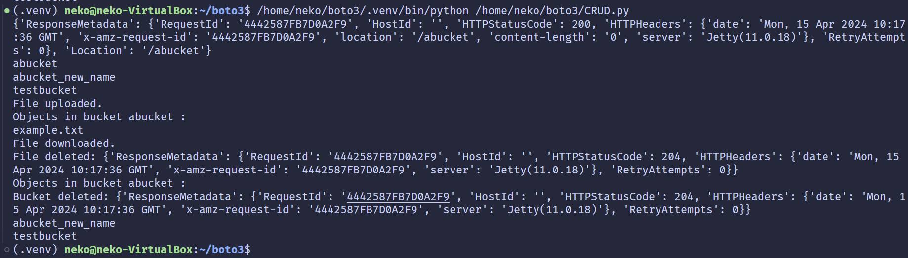

# 实验名称

实践基本功能

# 实验环境

Windows 11 下 VirtualBox 运行 Ubuntu 22.04 LTS，运行s3proxy作为对象存储系统，使用boto3访问s3proxy。
s3proxy 使用默认的设置，无需进行验证。

# 实验记录

为了实现基本的CRUD功能，我们撰写一个程序实现以下功能：

* 创建一个 Bucket (CREATE)
* 列出所有的 Bucket (READ)
* 上传/下载一个 Object 到 Bucket 中 (WRITE/READ)
* 删除一个 Bucket 中的 Objcet (DELETE)
* 删除一个 Bucket (DELETE)

借助简易的 [boto3 API](https://boto3.amazonaws.com/v1/documentation/api/latest/guide/quickstart.html) ，我们可以使用 python 很轻松的完成以上功能。

在程序的最开始我们需要连接到 s3 并创建一个 s3.client 实例。

```python
session = boto3.Session(
    aws_access_key_id='x', 
    aws_secret_access_key='x'
)

s3 = session.client('s3', endpoint_url='http://127.0.0.1:80')
```

我们随后可以使用实例中的 `create_bucket` 方法创建一个 bucket 。

```python
bucket_name = 'abucket'

# Create a bucket.
try:
    response = s3.create_bucket(Bucket=bucket_name)
    print(response)
except Exception as e:
    print(e)
```

我们撰写一个函数 `list_all_buckets` 来列出所有 bucket。
```python
def list_all_buckets(s3):
    response = s3.list_buckets()
    for buc in response['Buckets']:
        print(buc['Name'])

list_all_buckets(s3)
```

接下来，我们将一个示例文件 `exapmle.txt` 作为 Object 尝试上传到该 bucket 中。
其中 `example.txt` 为我们事先创建好的文件。

```python
def upload_file(s3, bucket_name, file_name, object_name=None):
    if object_name is None:
        object_name = file_name
    try:
        s3.upload_file(file_name, bucket_name, object_name)
        print("File uploaded.")
    except Exception as e:
        print(e)

file_name = 'example.txt'
upload_file(s3, bucket_name, file_name)
```

类似的，可以列出一个 bucket 中的所有 objects。

```python
def list_files_in_bucket(s3, bucket_name):
    try:
        response = s3.list_objects(Bucket=bucket_name)
        print("Objects in bucket", bucket_name, ":")
        for obj in response.get('Contents', []):
            print(obj['Key'])
    except Exception as e:
        print(e)
```

下载文件、删除文件、删除 bucket 在 boto3 中皆提供了接口。与上面类似，此处不再赘述。

```python
def download_file(s3, bucket_name, object_name, file_name):
    try:
        s3.download_file(bucket_name, object_name, file_name)
        print("File downloaded.")
    except Exception as e:
        print(e)

def delete_file(s3, bucket_name, object_name):
    try:
        response = s3.delete_object(Bucket=bucket_name, Key=object_name)
        print("File deleted:", response)
    except Exception as e:
        print(e)

def delete_bucket(s3, bucket_name):
    try:
        response = s3.delete_bucket(Bucket=bucket_name)
        print("Bucket deleted:", response)
    except Exception as e:
        print(e)
```

可以在 assets/CRUD.py 中看到完整的测试程序。
测试运行结果如下：



比对 `example.txt` 和 `downloaded_example.txt` 两个文件可以发现两者的内容是完全一样的。

至此 s3proxy+boto3 的 CRUD 即测试完毕。

# 实验小结

我们使用 s3proxy+boto3 撰写了程序对系统的 CRUD 功能进行了可行性测试。