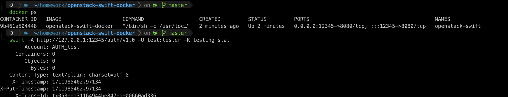
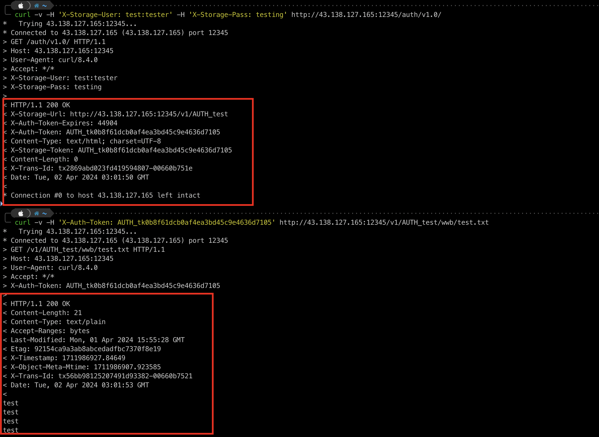
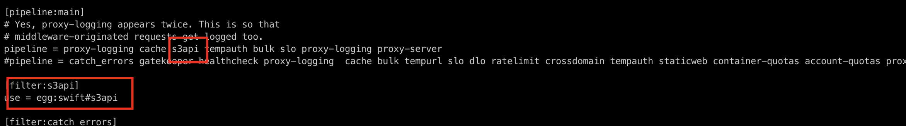
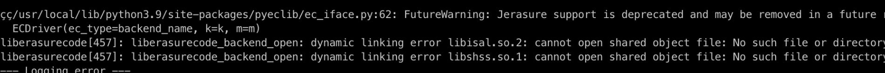
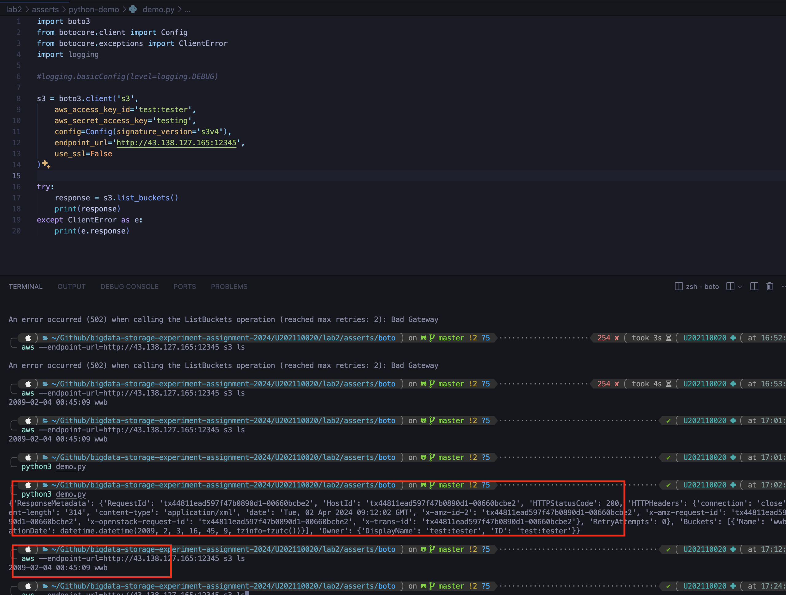

# 实验名称 

搭建对象存储

# 实验环境

OpenStack-Swift对象存储系统服务端部署在腾讯云服务器上，服务器规格：

| os     | Ubuntu20.04                              |
| ------ | ---------------------------------------- |
| cpu    | Intel Xeon Platinum 8255C (2) @ 2.494GHz |
| memory | 2G                                       |

服务器详细规格如下图所示：


# 实验记录 

1. OpenStack-Swift 对象存储系统服务端搭建

​	首先在服务器中安装 Openstack Swift 作为对象存储系统的服务端。 根据github openstack-swift-docker仓库给出的Dockerfile构建镜像，Dockerfile内容如下所示：

```dockerfile
FROM phusion/baseimage:0.9.22
MAINTAINER Zhan.Shi <g.shizhan.g@gmail.com>

RUN apt-get update && apt-get install -y \
    memcached rsync pwgen supervisor \
    python-xattr python-memcache python-netifaces \
    swift python-swiftclient swift-plugin-s3 \
    swift-account swift-proxy swift-object swift-container \
    python-keystoneclient

RUN mkdir -p /var/log/supervisor
ADD files/supervisord.conf /etc/supervisor/conf.d/supervisord.conf

ADD files/dispersion.conf /etc/swift/dispersion.conf
ADD files/rsyncd.conf /etc/rsyncd.conf
ADD files/swift.conf /etc/swift/swift.conf
ADD files/proxy-server.conf /etc/swift/proxy-server.conf
ADD files/account-server.conf /etc/swift/account-server.conf
ADD files/object-server.conf /etc/swift/object-server.conf
ADD files/container-server.conf /etc/swift/container-server.conf
ADD files/proxy-server.conf /etc/swift/proxy-server.conf
ADD files/startmain.sh /usr/local/bin/startmain.sh
RUN chmod 755 /usr/local/bin/*.sh

EXPOSE 8080

CMD /usr/local/bin/startmain.sh
```

​	之后构建Docker镜像，通过-v /srv选项，为busybox容器创建一个新的卷，并挂载至容器的/srv目录，最后创建一个新的Docker容器并运行openstack-swift-docker镜像，openstack-swift容器能够使用SWIFT_DATA容器的卷，这样便可以实现容器之间的数据共享，实现数据持久化。（个人感觉，现在持久化数据更好的方式是直接创建一个docker volume或者将本地目录mount到docker容器中，该仓库实现持久化的方式较为少见）。

```bash
docker build -t openstack-swift-docker .
docker run -v /srv --name SWIFT_DATA busybox
docker run -d --name openstack-swift -p 12345:8080 --volumes-from SWIFT_DATA -t openstack-swift-docker
```

​	通过docker ps 命令检测容器状态，可以检查openstack-swift server是否搭建成功。之后客户端边可通过服务器的 ip 地址加上 12345 端口号访问容器。



2. OpenStack-Swift 对象存储系统客户端搭建

​	客户端可以在服务器/本地搭建，pip3 install python-swiftclient 安装 python 的 python-swiftclient 库与 OpenStack-Swift 交互。通过swift client可以连接并查看服务端状态，例如连接服务器上的 OpenStack-Swift  server端，Containers表示此账户下有多少个容器，这里是1，Objects表示此账户下储存在容器中的对象（实际用户数据，例如文档、图片等）总数。


​	可以通过原生的http request查看server的状态，如下图所示进行身份认证以及查看对象存储server端存储文件内容。



​	为了使openstack-swift兼容s3协议，需要安装swift `pip install swift`，安装之后s3api middleware也安装成功。（由于docker镜像里的python默认为3.5版本，在安装pip时出现一点问题，因此参考https://linuxize.com/post/how-to-install-python-3-9-on-ubuntu-20-04/ 通过源码安装python3.9，之后安装最新pip，再安装swift）

​	之后`vim /etc/swift/proxy-server.conf` 修改配置文件，如图所示在pipeline中加入s3api middleware的调用。



​	 `swift-init restart all` 重启 OpenStack Swift 的所有服务，发现出现dynamic linking error的问题，经过查阅后根据https://github.com/openstack/liberasurecode 编译安装liberasurecode后解决。



​	之后使用boto库以及aws-sdk进行验证，`brew install awscli` 后对awscli配置access_key_id以及secret_access_key，之后可以正常访问服务器上的server，使用boto3 package写了一小段测试代码也可以正常访问服务器上的server。



# 实验小结

完成对象存储系统的客户端和服务端搭建。
