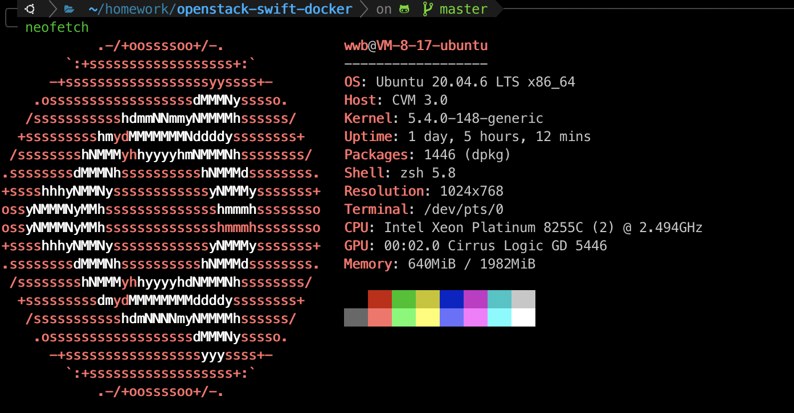
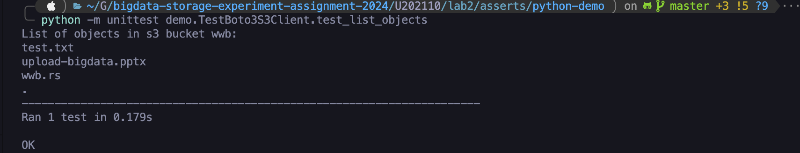
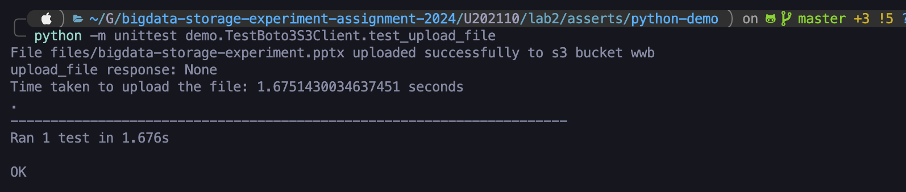
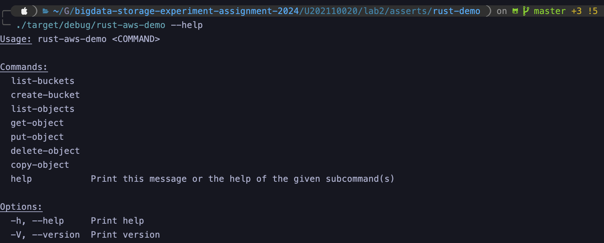
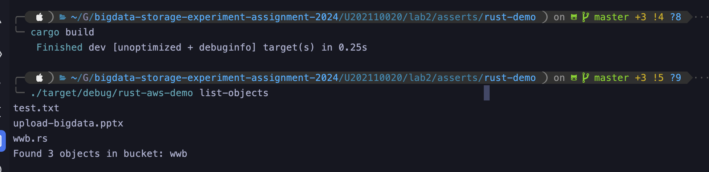
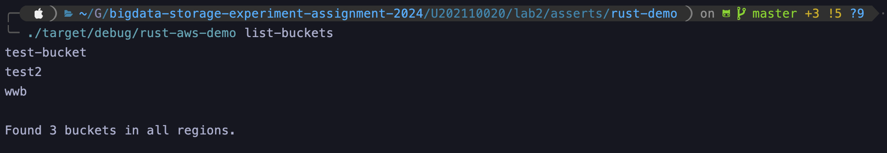
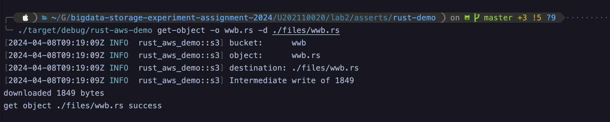
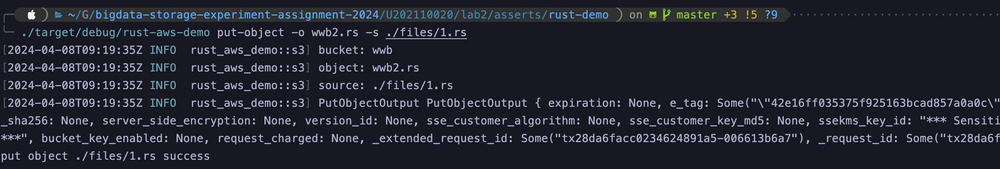
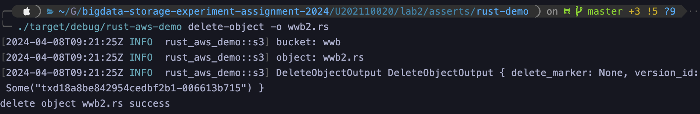
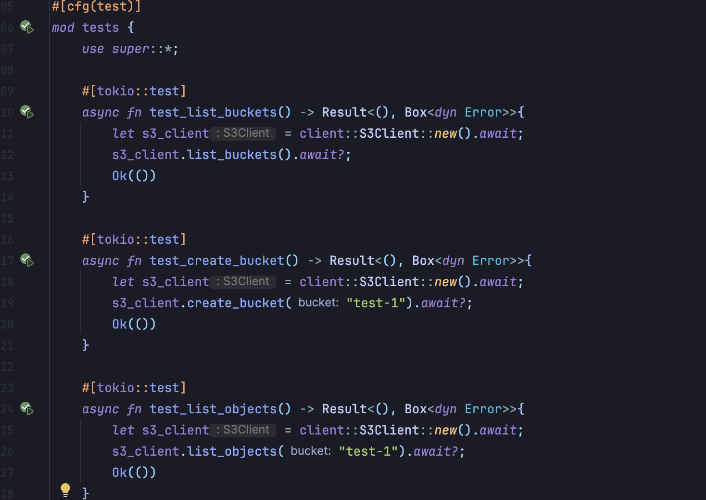

# 实验名称 

实践基本功能

# 实验环境

OpenStack-Swift对象存储系统服务端部署在腾讯云服务器上，服务器规格：

| os     | Ubuntu20.04                              |
| ------ | ---------------------------------------- |
| cpu    | Intel Xeon Platinum 8255C (2) @ 2.494GHz |
| memory | 2G                                       |
| server | openstack-swift                          |
| Client | boto3 & rust-aws-sdk                     |

服务器详细规格如下图所示：

# 实验记录 

在本次实验中，针对服务器上搭建的 openstack-swift server 端实现支持 crud 操作的两种 client：

- 基于 boto3 搭建的 python client，见[./asserts/python-demo](./asserts/python-demo)
- 基于 aws-sdk 搭建的 rust client，见[./asserts/rust-demo](./asserts/rust-demo)

### 1. python client

python client基于boto3库搭建，创建 Boto3S3Client class，并实现了list_buckets、create_bucket、list_objects 、get_object、put_object 、delete_object方法，实现了针对 openstack-swift server 的 crud操作。

同时基于 python unittest 实现单元测试，部分测试如下所示：

### 2. rust client

rust client基于aws-sdk搭建，使用rust clap搭建脚手架，实现对于 openstack-swift server bucket & object 的 crud 操作，如下图所示，基于 rust 搭建的 cli 工具目前支持子命令 list-buckets、create-bucket、list-objects 、get-object、put-object 、delete-object、copy-object  

cli 部分测试如下所示：

同时基于rust测试框架搭建了简易的单元测试，用于测试 crud 操作。

# 实验小结

完成 crud 基本功能
