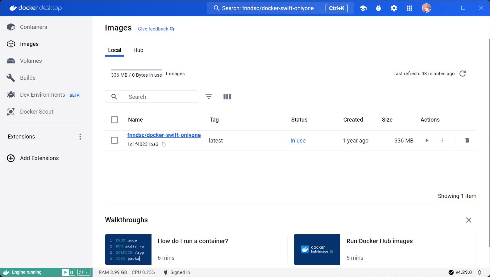
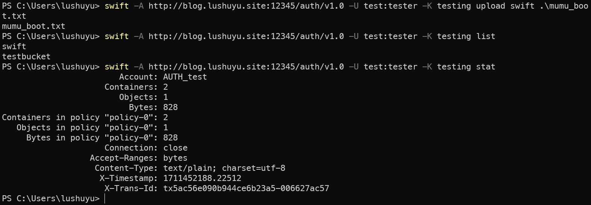

# 实验名称

分别在本地与远程搭建OpenStack Swift服务器并实现命令行交互与文件上传

# 实验环境

- PC配置：

```
DESKTOP-LOQAKP6
处理器：12th Gen Intel(R) Core(TM) i5-12400F   2.50 GHz
RAM：32.0 GB
系统：Windows 11 专业版 23H2
显卡：NVIDIA RTX 3070 Ti

Docker version 26.0.0, build 2ae903e
```

- 远程服务器配置：

远程服务器地址：`blog.lushuyu.site`（我的博客服务器，临时征用过来做实验）


# 实验记录

1. 在Windows端的Docker Hub中下载一个迷你版本的OpenStack Swift服务端



2. 分别在服务器与本地命令行中使用以下命令启动OpenStack Swift服务端

```sh
docker run -d --name swift-onlyone -p 12345:8080 -e SWIFT_USERNAME=test:tester -e SWIFT_KEY=testing -v swift_storage:/srv -t fnndsc/docker-swift-onlyone
```

3. pip安装python-swift之后，使用以下命令上传一个文件并查询Swift状态

```sh
swift -A http://<hostname>:12345/auth/v1.0 -U test:tester -K testing upload swift .\mumu_boot.txt

swift -A http://<hostname>:12345/auth/v1.0 -U test:tester -K testing list
swift -A http://<hostname>:12345/auth/v1.0 -U test:tester -K testing stat
```

- 本地结果：


- 远程服务器`blog.lushuyu.site`结果：



# 实验小结

本次实验成功部署了OpenStack Swift服务端，并使用Python-Swift连接，收获很多，踩了无数坑，部署了很多个swift版本之后才提炼出如此简单而又优雅的实验路径。

说起数据管理，我曾经在宿舍鼓捣过一个all in one的服务器，用PVE(Proxmox Virtual Environment)虚拟机做了黑群晖+openwrt，甚至做了一个Minecraft服务器（虽然很卡不能联机），部署成功之后还发帖庆祝了一下。


在群晖系统里面我又套了一个docker（没想到吧，虚拟机里面反复套娃），安装了一个jellyfin视频管理软件，对我硬盘里的电影进行刮削，这样我就能躺宿舍床上看小电影了。可惜我贪便宜闲鱼买的路由器带宽太低，有的电影码率太高没办法播放。

咳咳，扯远了，Proxmox Virtual Environment用的数据管理正是大名鼎鼎的ceph，实验课上看到了还挺意外的。