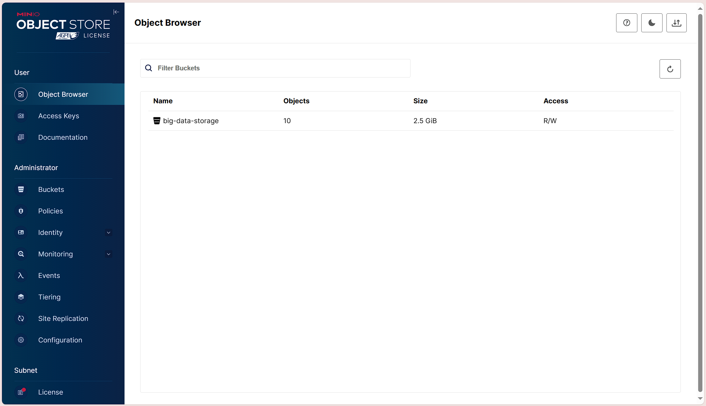
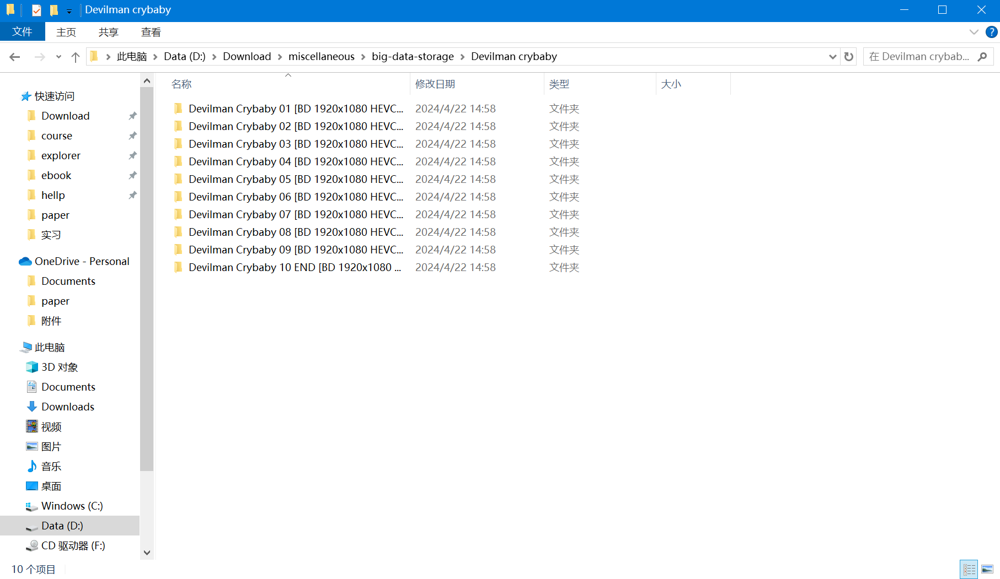

# 环境
## 实验环境
|||
|:-:|:-:|
|设备名称|YoursHugo|
|处理器|AMD Ryzen 7 4800H with Radeon Graphics            2.90 GHz|
|机带 RAM|	16.0 GB (15.4 GB 可用)
|设备 ID|	5B22F99C-278C-4BCB-B5FC-7BCF85074A34
|产品 ID|	00342-35957-71532-AAOEM
|系统类型|	64 位操作系统, 基于 x64 的处理器
|笔和触控|	为 10 触摸点提供触控支持|
## 软件环境
|||
|:-:|:-:|
|git|git version 2.44.0.windows.1|
|Python|Python 3.12.3|
|pip|pip 24.0|
|Docker|Docker version 26.0.0, build 2ae903e|
|WSL|2.1.5.0|
|内核版本|5.15.146.1-2|
|Windows 版本| 10.0.19045.4291
# 对象存储服务器
## MinIO server
[MinIO](https://min.io/) 是一种高性能、S3 兼容的对象存储。 它专为大规模 AI/ML、数据湖和数据库工作负载而构建。 它是软件定义的，可以在任何云或本地基础设施上运行。 MinIO 拥有开源 GNU AGPL v3 和商业企业许可证的双重许可。

使用如下命令下载 MinIO server 并启动 MinIO server：
```powershell
Invoke-WebRequest -Uri "https://dl.min.io/server/minio/release/windows-amd64/minio.exe" -OutFile "C:\minio.exe"
setx MINIO_ROOT_USER admin
setx MINIO_ROOT_PASSWORD password
cd D:\Download
.\minio.exe server D:\Download\miscellaneous\ --console-address ":9001"
```
在浏览器中打开 `https://localhost:9001`,输入账户名`admin`和密码`password`，即可进入 MinIO server 管理界面。


进入MinIO server 管理界面后，可以看到 MinIO server 的基本信息，包括服务器状态、磁盘使用情况、服务器信息等。

在`Administrator`栏下新建一个桶`big-data-storage`，并上传`《Devilman Crybaby》`共十个mkv文件。

退出 MinIO server 管理界面后，可以在`D:\Download\miscellaneous\big-data-storage\Devilman crybaby`中找到MinIO server 的桶和文件，如下图所示。

## Openstack Swift
待补充
# 对象存储客户端
## MinIO client
[MinIO client](https://docs.min.io/docs/minio-client-quickstart-guide) 是一个开源的命令行工具，用于上传、下载和管理文件。MinIO client 支持文件系统和 Amazon S3 兼容的云存储服务。MinIO client 是 MinIO server 的一个客户端工具，可以通过 MinIO client 连接到 MinIO server 并管理文件。MinIO client 是一个独立的二进制文件，可以在 Linux、Mac 和 Windows 上运行。MinIO client 是一个开源项目，使用 Apache License 2.0 许可证。

使用如下命令下载 MinIO client：
```powershell
Invoke-WebRequest -Uri "https://dl.minio.io/client/mc/release/windows-amd64/mc.exe" -OutFile "D:\Download\mc.exe"
D:\Download\mc.exe alias set myminio/ http://MINIO-SERVER MYUSER MYPASSWORD
```
使用如下命令上传文件到 MinIO server：
```powershell
D:\Download\mc.exe cp D:\Download\miscellaneous\big-data-storage\Devilman\ myminio/big-data-storage/Devilman --recursive
```
使用如下命令下载文件到本地：
```powershell
D:\Download\mc.exe cp myminio/big-data-storage/Devilman D:\Download\miscellaneous\big-data-storage\Devilman --recursive
```
## Openstack Swift client
待补充