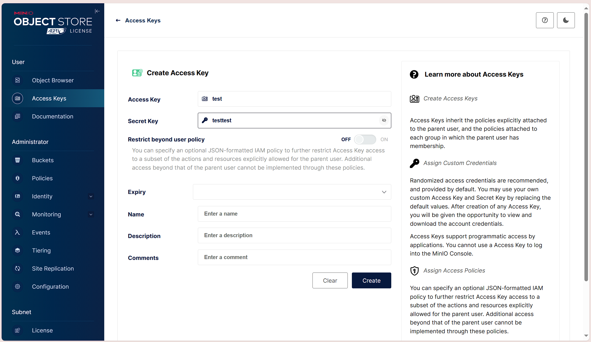

# 实验名称
观测分析性能
# 实验目的
观察分析吞吐量、不同对象大小下的延迟、并发、服务器总数对云存储服务器性能的影响。
# 实验内容
首先启动MinIO Server服务，在localhost:9001页面上创建一个`accessKey`和`accessSecret`。如图所示：


输入如下命令启动S3bench对MinIO Server进行测试：
```powershell
 ./s3bench -accessKey=test -accessSecret=testtest -bucket=big-data-storage -endpoint=http://localhost:9000 -numClients=2 -numSamples=10 -objectNamePrefix=loadgen -objectSize=1024
 ```
得到输出如下：
```powershell
Test parameters
endpoint(s):      [http://localhost:9000]
bucket:           big-data-storage
objectNamePrefix: loadgen
objectSize:       0.0010 MB
numClients:       2
numSamples:       10
verbose:       %!d(bool=false)


Generating in-memory sample data... Done (0s)

Running Write test...

Running Read test...

Test parameters
endpoint(s):      [http://localhost:9000]
bucket:           big-data-storage
objectNamePrefix: loadgen
objectSize:       0.0010 MB
numClients:       2
numSamples:       10
verbose:       %!d(bool=false)


Results Summary for Write Operation(s)
Total Transferred: 0.010 MB
Total Throughput:  0.06 MB/s
Total Duration:    0.156 s
Number of Errors:  0
------------------------------------
Write times Max:       0.105 s
Write times 99th %ile: 0.105 s
Write times 90th %ile: 0.105 s
Write times 75th %ile: 0.015 s
Write times 50th %ile: 0.014 s
Write times 25th %ile: 0.013 s
Write times Min:       0.012 s


Results Summary for Read Operation(s)
Total Transferred: 0.010 MB
Total Throughput:  0.62 MB/s
Total Duration:    0.016 s
Number of Errors:  0
------------------------------------
Read times Max:       0.004 s
Read times 99th %ile: 0.004 s
Read times 90th %ile: 0.004 s
Read times 75th %ile: 0.004 s
Read times 50th %ile: 0.003 s
Read times 25th %ile: 0.003 s
Read times Min:       0.002 s


Cleaning up 10 objects...
Deleting a batch of 10 objects in range {0, 9}... Succeeded
Successfully deleted 10/10 objects in 58.7777ms
```
写脚本对测试参数进行修改，分别测试`numClients`、`numSamples`以及`objectSize`对性能的影响,脚本见 ./assets/test.bat
# 实验结论
|unit/s|numClients2|numClients2|numClients2|numClients2|numClients2|
|:-:|:-:|:-:|:-:|:-:|:-:|
|Write Total Duration|0.144|0.097|0.087|0.135|0.091|
|Write Time Max|0.059|0.069|0.069|0.128|0.090|
|Write Time Min|0.011|0.012|0.018|0.021|0.072|
|Read Total Duration|0.015|0.011|0.009|0.011|0.011|
|Read Time Max|0.004|0.008|0.007|0.010|0.011|
|Read Time Min|0.003|0.003|0.003|0.003|0.003|

|unit/s|numSamples10|numSamples20|numSamples30|numSamples40|numSamples50|
|:-:|:-:|:-:|:-:|:-:|:-:|
|Write Total Duration|0.159|0.238|0.271|0.301|0.357|
|Write Time Max|0.059|0.057|0.062|0.057|0.062|
|Write Time Min|0.013|0.014|0.010|0.004|0.004|
|Read Total Duration|0.016|0.039|0.043|0.055|0.078|
|Read Time Max|0.004|0.005|0.004|0.005|0.005|
|Read Time Min|0.003|0.003|0.002|0.001|0.002|

|unit/s|objectSize512|objectSize1024|objectSize2048|objectSize4096|objectSize8192|
|:-:|:-:|:-:|:-:|:-:|:-:|
|Write Total Duration|0.108|0.115|0.112|0.100|0.114|
|Write Time Max|0.057|0.061|0.057|0.056|0.058|
|Write Time Min|0.012|0.013|0.012|0.010|0.011|
|Read Total Duration|0.014|0.016|0.016|0.015|0.015|
|Read Time Max|0.003|0.004|0.004|0.004|0.004|
|Read Time Min|0.003|0.003|0.003|0.002|0.002|

根据上述表格的统计数据，可以得出以下结论：

1. 对于`numClients`参数，随着`numClients`的增加，写操作的总持续时间逐渐减少，但是读操作的总持续时间保持稳定。这表明增加并发客户端可以提高写操作的性能，但对读操作的性能影响较小。

2. 对于`numSamples`参数，随着`numSamples`的增加，写操作和读操作的总持续时间逐渐增加。这表明增加样本数会增加测试的总时间，但不一定会提高性能。

3. 对于`objectSize`参数，随着对象大小的增加，写操作和读操作的总持续时间保持稳定。这表明对象大小对性能的影响较小。

综上所述，增加并发客户端可以提高写操作的性能，增加样本数会增加测试的总时间，而对象大小对性能的影响较小。

# 实验总结
本次实验通过对MinIO Server进行测试，观察分析了吞吐量、不同对象大小下的延迟、并发、服务器总数对云存储服务器性能的影响。通过实验，我们发现增加并发客户端可以提高写操作的性能，增加样本数会增加测试的总时间，而对象大小对性能的影响较小。这些结论对于我们进一步优化云存储服务器的性能具有一定的参考价值。
同时本次实验也 发现了一些问题，例如测试结果中的一些数据可能存在误差，需要进一步优化测试脚本和测试环境，以提高测试结果的准确性。希望在今后的实验中能够进一步完善测试方法，提高测试结果的准确性，为云存储服务器的性能优化提供更多的参考信息。

