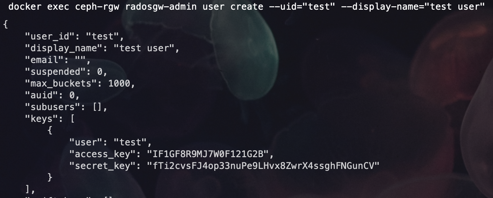

# 实验名称
搭建对象存储系统ceph

# 实验环境
- 操作系统：ubuntu22.04
- 容器： docker
- 编辑器：vscode(远程ssh连接)
  

# 实验记录
## 实验1-1：搭建ceph集群
远程连接到服务器
```sh 
ssh -p 22 username@ip
```
创建用于ceph单机集群的docker网络
```
docker network create --driver bridge --subnet 172.20.0.0/16 ceph-network
```
拉取ceph镜像
```
docker pull ceph/daemon:latest
```
创建挂载目录并修改权限
```
sudo mkdir -p /var/lib/ceph /var/log/ceph /etc/ceph

sudo chmod -R 777 /var/lib/ceph /var/log/ceph /etc/ceph

```
启动mon节点
```
docker run -d --name ceph-mon --network ceph-network --ip 172.20.0.10 -e CLUSTER=ceph -e WEIGHT=1.0 -e MON_IP=172.20.0.10 -e MON_NAME=ceph-mon -e CEPH_PUBLIC_NETWORK=172.20.0.0/16 -v /etc/ceph:/etc/ceph -v /var/lib/ceph/:/var/lib/ceph/ -v /var/log/ceph/:/var/log/ceph/ ceph/daemon mon
```
修改配置文件以兼容etx4
```
vim /etc/ceph/ceph.conf

// 追加
osd max object name len = 256
osd max object namespace len = 64
```
创建osd目录并修改权限
```
sudo mkdir -p /var/lib/ceph/osd/ceph-1 /var/lib/ceph/osd/ceph-2 /var/lib/ceph/osd/ceph-3

sudo chmod -R 777 /var/lib/ceph/osd/ceph-1 /var/lib/ceph/osd/ceph-2 /var/lib/ceph/osd/ceph-3
```
获取osd验证密钥
```
docker exec ceph-mon ceph auth get client.bootstrap-osd -o /var/lib/ceph/bootstrap-osd/ceph.keyring
```
分别启动三个osd
```
docker run -d --privileged=true --name ceph-osd-1 --network ceph-network --ip 172.20.0.11 -e CLUSTER=ceph -e WEIGHT=1.0 -e MON_NAME=ceph-mon -e MON_IP=172.20.0.10 -e OSD_TYPE=directory -v /etc/ceph:/etc/ceph -v /var/lib/ceph/:/var/lib/ceph/ -v /var/lib/ceph/osd/ceph-1:/var/lib/ceph/osd -v /etc/localtime:/etc/localtime:ro ceph/daemon:latest osd
```
```
docker run -d --privileged=true --name ceph-osd-2 --network ceph-network --ip 172.20.0.12 -e CLUSTER=ceph -e WEIGHT=1.0 -e MON_NAME=ceph-mon -e MON_IP=172.20.0.10 -e OSD_TYPE=directory -v /etc/ceph:/etc/ceph -v /var/lib/ceph/:/var/lib/ceph/ -v /var/lib/ceph/osd/ceph-2:/var/lib/ceph/osd -v /etc/localtime:/etc/localtime:ro ceph/daemon:latest osd
```
```
docker run -d --privileged=true --name ceph-osd-3 --network ceph-network --ip 172.20.0.13 -e CLUSTER=ceph -e WEIGHT=1.0 -e MON_NAME=ceph-mon -e MON_IP=172.20.0.10 -e OSD_TYPE=directory -v /etc/ceph:/etc/ceph -v /var/lib/ceph/:/var/lib/ceph/ -v /var/lib/ceph/osd/ceph-3:/var/lib/ceph/osd -v /etc/localtime:/etc/localtime:ro ceph/daemon:latest osd
```
启动mgr节点
```
docker run -d --privileged=true --name ceph-mgr --network ceph-network --ip 172.20.0.14 -e CLUSTER=ceph -p 7000:7000 --pid=container:ceph-mon -v /etc/ceph:/etc/ceph -v /var/lib/ceph/:/var/lib/ceph/ ceph/daemon:latest mgr
```
获取rgw验证密钥
```
docker exec ceph-mon ceph auth get client.bootstrap-rgw -o /var/lib/ceph/bootstrap-rgw/ceph.keyring
```
启动rgw节点
```
docker run -d --privileged=true --name ceph-rgw --network ceph-network --ip 172.20.0.15 -e CLUSTER=ceph -e RGW_NAME=ceph-rgw -p 7480:7480 -v /var/lib/ceph/:/var/lib/ceph/ -v /etc/ceph:/etc/ceph -v /etc/localtime:/etc/localtime:ro ceph/daemon:latest rgw
```
查看ceph状态
```
docker exec ceph-mon ceph -s
```
添加测试用户,获取access_key和secret_key
```
docker exec ceph-rgw radosgw-admin user create --uid="test" --display-name="test user"
```

保存生成的access_key和secret_key到~/.aws/credentials中
```
echo -e "[default]\naws_access_key_id = IF1GF8R9MJ7W0F121G2B\naws_secret_access_key = fTi2cvsFJ4op33nuPe9LHvx8ZwrX4ssghFNGunCV" > ~/.aws/credentials
```

# 实验小结
本次实验我学习了docker的基本命令，并利用docker部署了一个单机的ceph集群，这让我体会到了docker提供的便捷。

