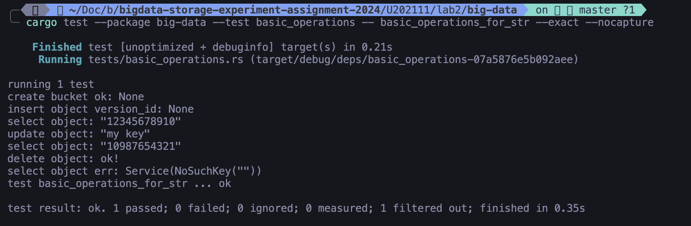
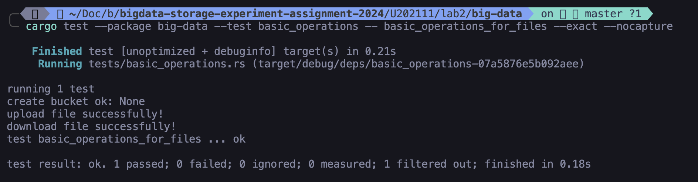
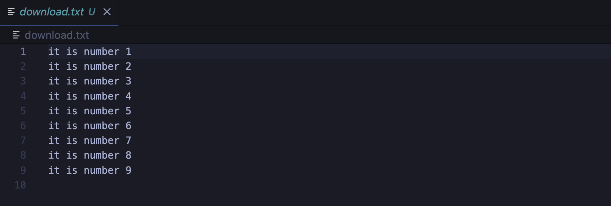
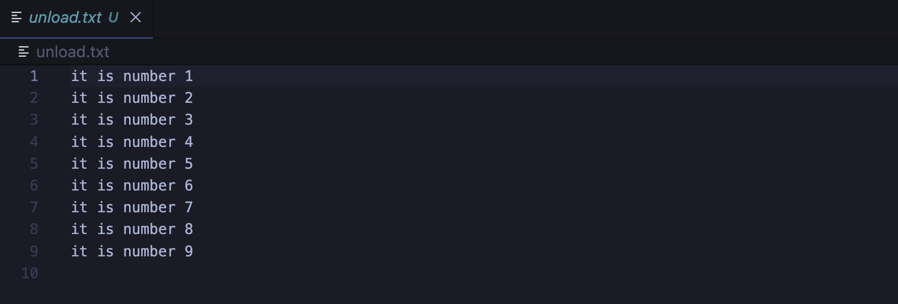

# 实验名称
测试ceph基本功能

# 实验环境
- 操作系统：ubuntu22.04
- 容器： docker
- 编辑器：vscode(远程ssh连接)
- 编程框架：aws-sdk-rust


# 实验记录
采用aws-sdk-rust编写操作ceph的api，[代码地址](./big-data/)
测试脚本
```
cd ./assets
sh run.sh
```

## 实验2-1：测试对于string类型对象的增删改查
- 测试basic_operations_for_str，注意指定环境变量END_POINT(ip:port)，同时确保~/.aws/credentials含有正确内容
- 测试结果


## 实验2-2：测试对文件对象上传和下载
- 测试basic_operations_for_files，注意指定环境变量END_POINT(ip:port)，同时确保~/.aws/credentials含有正确内容
- 测试结果



可以看到，上传的文件和下载的文件内容一致。

# 实验小结
本次实验我选择使用aws-sdk-rust完成实验，成功测试了ceph对象存储对于字符串和文件的存储功能，这说明ceph运行良好。
