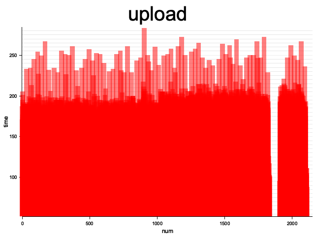
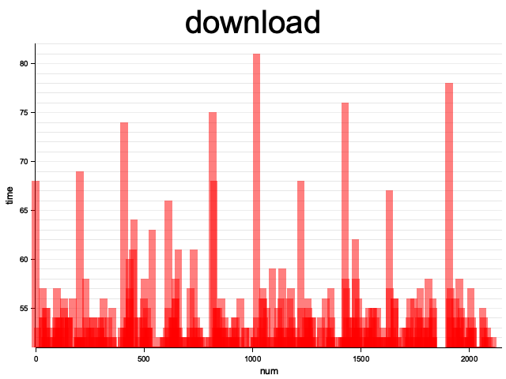
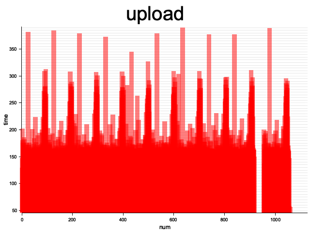
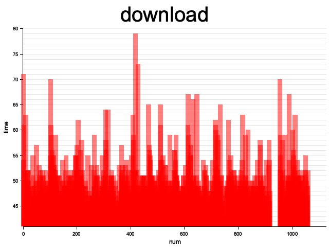
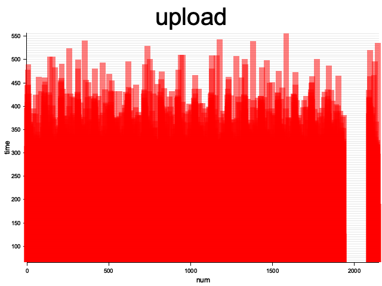
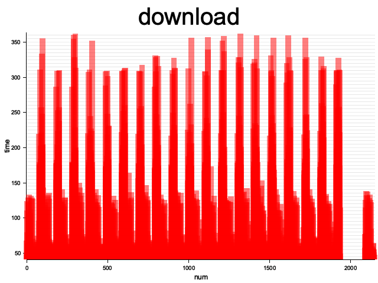

# 实验名称
分析并发状态下请求延时

# 实验环境
- 操作系统：ubuntu22.04
- 容器： docker
- 编辑器：vscode(远程ssh连接)
- 编程框架：aws-sdk-rust

# 实验记录

本次实验主要在获取并发状态下上传文件和下载文件时延，并以此在利用rust第三方库[plotters](https://github.com/plotters-rs/plotters/tree/master)绘制时延图像观测分析。\
具体采用控制变量法，测试三组数据：
- 并发度10 文件总大小10mb 单个文件大小5kb
- 并发度10 文件总大小10mb 单个文件大小10kb
- 并发度20 文件总大小10mb 单个文件大小5kb

## 实验3-1 测试第一项
### 实验步骤
运行脚本
```
cd ./assets
sh test_1.sh
cd ../figure/test_1
ls
```
### 实验现象


### 结果分析
- 上传操作大部分时延集中在200ms左右，但也有一部分在250ms左右
- 下载操作总体时延相对上传操作整体耗时更低，大部分时延维持在55ms左右，但也有相当一部分时延超过60ms到达了70ms左右
### 实验结论
并发状态下，发现上传文件操作和下载文件操作都出现了相当数量的请求时延偏离平均时延。

## 实验3-2 测试第二项
### 实验步骤
```
cd ./assets
sh test_2.sh
cd ../figure/test_2
ls
```
### 实验现象



### 结果分析
相比实验3-1，每次上传的文件大小由5kb调整到10kb，一次上传的数据量增加。
- 上传文件操作大部分请求时延在200ms左右，通过图像颜色深度发现也有较多请求的时延来到了300ms及以上
- 下载文件操作大部分请求时延在50-55ms，通过图像颜色深度发现也有较多请求的时延来到了60ms及以上

### 实验结论
对比实验3-1，我们发现相同并发度下，增加传输的字节量（即文件大小）请求时延偏离正常值的请求会出现增加。因此，实际运用过程中，如果某天请求量一定，优化请求体大小有利于维持系统稳定。

## 实验3-3 测试第三项
### 实验步骤
```
cd ./assets
sh test_3.sh
cd ../figure/test_3
ls
```
### 实验现象



### 结果分析
相比实验3-1，我们将并发度由10提升至20
- 上传文件操作大部分请求时延在400ms左右，通过图像颜色深度发现也有较多请求的时延来到了450ms及以上，最大到达了500ms
- 下载文件操作请求时延一半集中在125ms左右，另一半300-350ms之间，整体请求时延出现了较大的分歧

### 实验结论
对比实验3-1，我们发现每次请求传输的数据量一定，并发度对请求时延分布影响很大，具体表现在增大并发度，每次请求时延出现增加，尾延迟现象变得更加明显，这说明并发度对系统是一个巨大的挑战，优化系统来抵抗大量并发以保证请求时延的稳定应当是首选目标。

