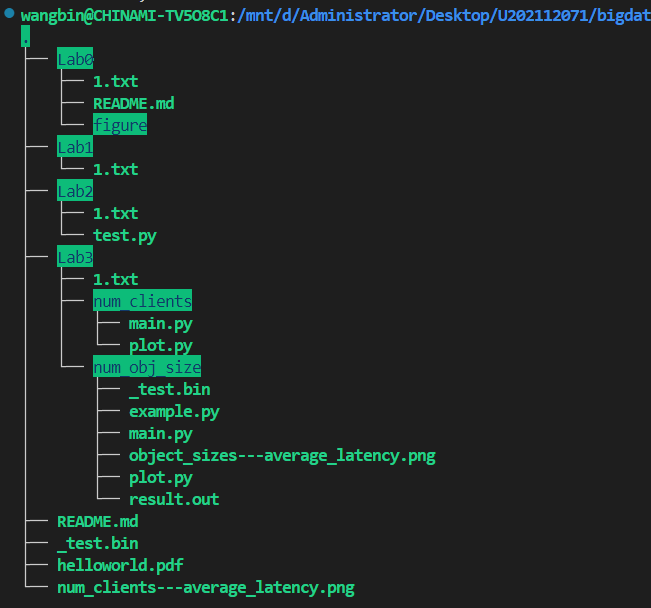

# 实验环境
## 设备
- 设备名称	CHINAMI-TV5O8C1
- 处理器	Intel(R) Core(TM) i5-7300HQ CPU @ 2.50GHz   2.50 GHz
- 机带 RAM	8.00 GB (7.87 GB 可用)
- 设备 ID	1B3E14D6-1946-4087-B08A-780230EA6146
- 产品 ID	00326-10000-00000-AA970
- 系统类型	64 位操作系统, 基于 x64 的处理器
- 笔和触控	没有可用于此显示器的笔或触控输入

## 服务环境
- WSL2: Ubuntu 22.04.4 LTS (GNU/Linux 5.10.102.1-microsoft-standard-WSL2 x86_64)

# 实验过程
## 1. 安装 Git
```bash
sudo apt update
sudo apt install git
```
## 2. 拉取作业库
```bash
git clone https://github.com/3444374/bigdata-storage-experiment-assignment-2024.git
cd ./bigdata-storage-experiment-assignment-2024
```

## 3. 建立自己的作业目录，以学号命名
```bash
mkdir U202112071
```


## 4. 添加推送
```bash
git add .
git commit -m "add: U202112071 Lab0"
git push
```
