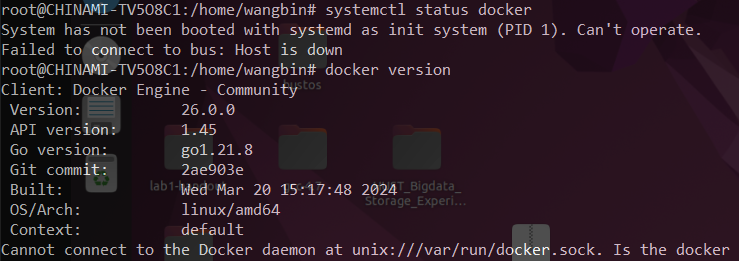
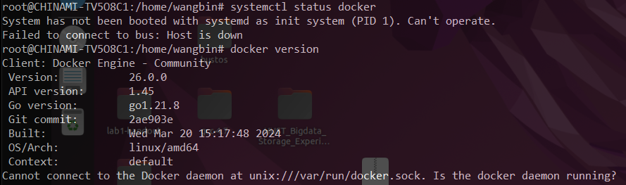
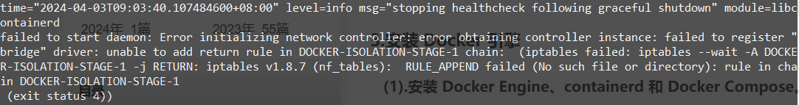
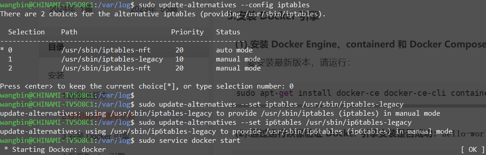
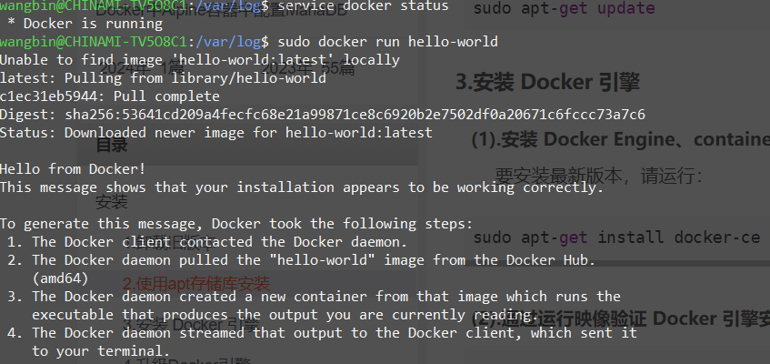
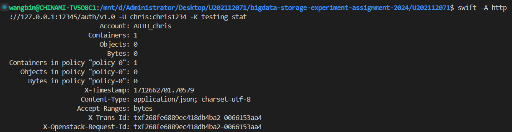
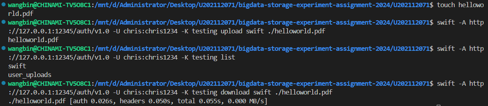

# 实验名称
对象存储的基本功能

## 实验环境
- WSL2: Ubuntu 22.04.4 LTS (GNU/Linux 5.10.102.1-microsoft-standard-WSL2 x86_64)

## 实验过程
本实验我配置得比较麻烦，具体的原因是一些环境变量原本的配置不正确
### 安装docker
首先运行下列指令卸载所有冲突的软件包
```bash
for pkg in docker.io docker-doc docker-compose podman-docker containerd runc; do sudo apt-get remove $pkg; done
```
软件包索引更新
```bash
sudo apt-get update
sudo apt-get install ca-certificates curl gnupg
```
添加Docker官方GPG密钥
```bash
sudo install -m 0755 -d /etc/apt/keyrings
curl -fsSL https://download.docker.com/linux/debian/gpg | sudo gpg --dearmor -o /etc/apt/keyrings/docker.gpg
sudo chmod a+r /etc/apt/keyrings/docker.gpg
```
添加Docker官方APT存储库
```bash
echo \
  "deb [arch="$(dpkg --print-architecture)" signed-by=/etc/apt/keyrings/docker.gpg] https://download.docker.com/linux/debian \
  "$(. /etc/os-release && echo "$VERSION_CODENAME")" stable" | \
  sudo tee /etc/apt/sources.list.d/docker.list > /dev/null
```
更新软件包索引
```bash
sudo apt-get update
```
安装Docker
```bash
sudo apt-get install docker-ce docker-ce-cli containerd.io docker-buildx-plugin docker-compose-plugin
```
尝试运行docker映像
```bash
sudo docker run hello-world
```
失败，原因是docker服务未启动

这里是因为wsl2并不是作为系统的首进程（PID=1）调用的，无法使用
```bash
systemctl status docker
```
进行启动，而需要使用
```bash
sudo service docker start
```
但随后仍然有错误，这里如果键入
```bash
docker version
```
可以显示出docker版本，但是docker无法连接

同时，如果启动docker，刚开始会显示OK，但随后调用docker ps，发现仍然无法启动。
这里我们去/var/log下查看docker.log，发现有一些错误

解决方法是运行下列指令：
```bash
sudo update-alternatives --config iptables
sudo update-alternatives --set iptables /usr/sbin/iptables-legacy
sudo update-alternatives --set ip6tables /usr/sbin/ip6tables-legacy
```
将iptables和ip6tables的默认版本设置为legacy版本，这样docker就可以正常运行了

这时候我们再sudo docker run hello-world，就可以看到成功的输出了


### 安装OpenStack Swift
首先创建swift卷
```bash
docker volume create swift-storage
```
然后运行swift容器
```bash
docker run -d --name swift-onlyone -p 12345:8080 -v swift-storage:/srv -t fnndsc/docker-swift-onlyone
```
这样就可以使用swift客户端连接到swift容器了
```bash
pip install python-swiftclient
```
然后我们可以使用swift客户端连接到swift容器
```bash
swift -A http://127.0.0.1:12345/auth/v1.0 -U chris:chris1234 -K testing stat
```
尝试上传文件
```bash
swift -A http://127.0.0.1:12345/auth/v1.0 -U chris:chris1234 -K testing upload --object-name mypdf.pdf user_uploads ./mypdf.pdf
```
尝试下载文件
```bash
swift -A http://127.0.0.1:12345/auth/v1.0 -U chris:chris1234 -K testing download user_uploads ./mypdf.pdf
```


