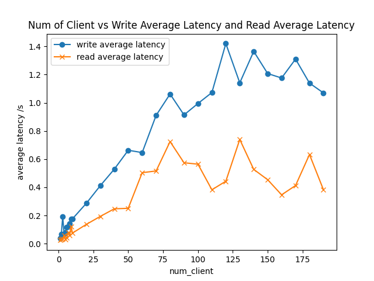
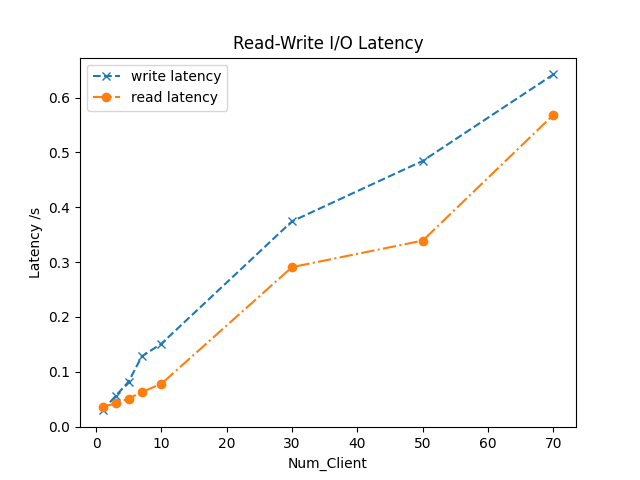
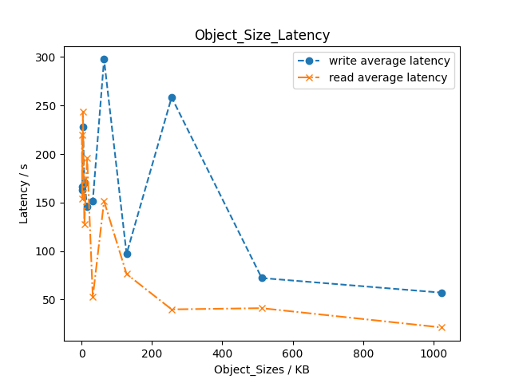

# 实验记录
研究客户端数量、读写请求大小
## 测试环境
- 设备名称	CHINAMI-TV5O8C1
- 处理器	Intel(R) Core(TM) i5-7300HQ CPU @ 2.50GHz   2.50 GHz
- 核心数    4
- 机带 RAM	8.00 GB (7.87 GB 可用)
- 设备 ID	1B3E14D6-1946-4087-B08A-780230EA6146
- 产品 ID	00326-10000-00000-AA970
- 系统类型	64 位操作系统, 基于 x64 的处理器
- 笔和触控	没有可用于此显示器的笔或触控输入
- Linux版本 WSL2 -Ubuntu 22.04LTS

## 实验过程

写入过程的调用写入方法为，调用Swift-client的python库API进行写入
```bash
def bench_put(i):
    obj_name = '%s%08d' % (object_name_prefix, i) 
    start = time.time()
    with open(local_file, 'rb') as f:
        conn.put_object(bucket_name, obj_name, f) 
    end = time.time()
    duration = end - start
    client = current_thread().name
    return (duration, start, end, client)
```
读取、删除方法类似。
测试段方法为：
```bash
    with tqdm(desc="Accessing S3", total=num_samples) as pbar:
        with ThreadPoolExecutor(max_workers=num_client) as executor:
            futures = [executor.submit(switch[test_type],i) for i in range(num_samples)]
            for future in as_completed(futures):
                if future.exception():
                    failed_requests.append(future)
                else:
                    latency.append(future.result()) 
                pbar.update(1)
```

客户端实验参数如下
| 属性 | 值 |
| ---- | ----- |
| 总大小 | 1024KB |
| 对象大小 | 8KB |
| 样本数 | 256 |
| 读写客户端数量 | [1,2,3,4,5,6,7,8,9,10,30,50,70,90]|

客户端数量与读写延迟的关系如下图所示。



保持总读写大小相同时，改变读写文件的大小，我们测试Swift的延迟，实验参数如下
| 属性 | 值 |
| ---- | ----- |
| 总大小 | 1024KB |
| 对象大小 | [1,2,4,8,16,32,64,128,256,512,1024]KB |
| 样本数 | 256 |
| 读写客户端数量 | 10 |

读写大小和服务器端延迟的关系如下图所示。


## 实验小结
测试结果说明随着客户机数量的增加，服务延迟呈现出先上升后波动稳定的状态。这可能是因为读写文件大小总量相对恒定，达到服务机的服务限度。
而随着对象大小的增加，服务器延迟则有明显下降趋势，这是因为所需要响应的请求数下降；而大小进一步增加时，延迟呈现出轻微的上升，这是因为单一请求的文件大小过大。