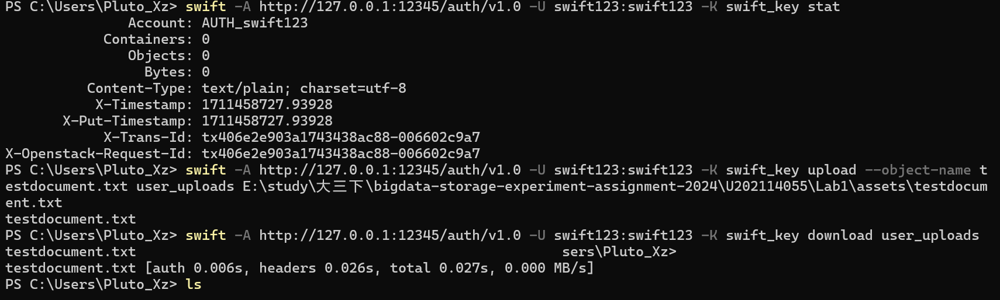
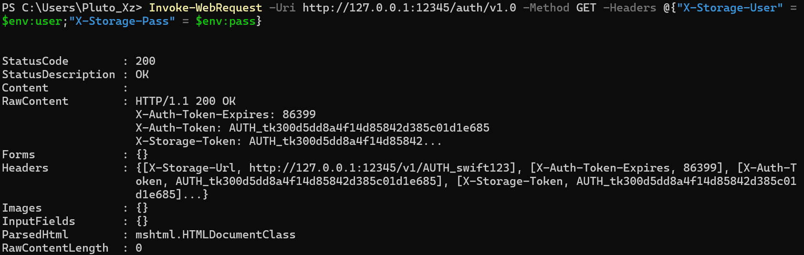
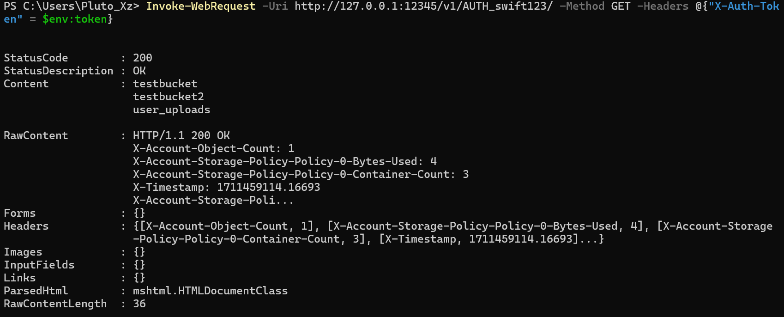
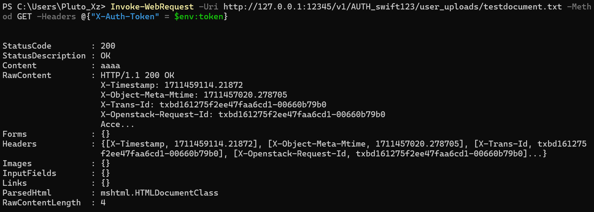

# 实验名称
***Lab 1 搭建对象存储***
# 实验环境

- docker镜像：fnndsc/docker-swift-onlyone
- docker版本：Docker Desktop v4.25.0
- 宿主机系统：Windows10
- openstack-swift版本：2.33.0
- s3中间件：s3api

# 实验记录

## docker部署openstack-swift
[使用docker安装openstack-swift环境参考资料](https://hub.docker.com/r/fnndsc/docker-swift-onlyone)

首先使用`docker pull fnndsc/docker-swift-onlyone`命令，从docker hub中拉取最新的openstack-swift镜像，然后使用`docker volume create swift_storage`创建存储卷，
最后使用`docker run -d --name swift-onlyone -p 12345:8080 -e SWIFT_USERNAME=swift123:swift123 -e SWIFT_KEY=swift_key -v swift_storage:/srv -t fnndsc/docker-swift-onlyone`. 这条指令的意思是：创建并运行一个名为swift-onlyone的容器并将容器的8080端口映射到宿主机的12345端口，再以fnndsc/docker-swift-onlyone为镜像，swift_storage为存储卷。并且添加了用户名和密钥这两个环境变量。

---
之后我们可以在宿主机的终端上进行如下的测试：



docker ip为172.17.0.2
```
$env:user="swift123:swift123"
$env:pass="swift_key"
Invoke-WebRequest -Uri http://127.0.0.1:12345/auth/v1.0 -Method GET -Headers @{"X-Storage-User" = $env:user;"X-Storage-Pass" = $env:pass}
```

```
$env:token="AUTH_tk300d5dd8a4f14d85842d385c01d1e685"
Invoke-WebRequest -Uri http://127.0.0.1:12345/v1/AUTH_swift123/ -Method GET -Headers @{"X-Auth-Token" = $env:token}
```

```
Invoke-WebRequest -Uri http://127.0.0.1:12345/v1/AUTH_swift123/user_uploads/testdocument.txt -Method GET -Headers @{"X-Auth-Token" = $env:token}
```

经过上面的验证可以发现我们的服务端部署成功。

## swift s3api 中间件配置安装
因为在后续的实验当中我们还需要用到s3 api接口，所以我们还需要对swift进行一定的配置。
`docker exec -it swift-onlyone bash` 进入docker命令行。
`find -name "proxy-server.conf"`

首先`apt install swift-plugin-s3`

因为查阅资料发现`swift3`中间件已经过时并且不再维护，所以我们这里选择了最新的 [s3api middleware](https://docs.openstack.org/swift/latest/middleware.html#module-swift.common.middleware.s3api.s3api)
在配置文件中找到` pipeline = `部分，将 s3api 中间件添加到 pipeline 中，并确保添加在身份验证中间件（这里我们是tempauth）之前。
例如这里我们需要将其放到 tempauth的前面。(同时还要确保有bulk和slo，这里我们都默认有)

添加到 pipeline 之后再在 pipline 的下面添加
```conf
[filter:s3api]
use = egg:swift#s3api
s3_acl = yes
check_bucket_owner = yes
cors_preflight_allow_origin = *
s3_endpoint = http://localhost:12346
```


进行完上述配置之后我们重启docker容器，然后在客户端`pip install awscli`安装。
使用指令`aws --endpoint-url=http://127.0.0.1:12345 SWIFT_USERNAME=swift123:swift123 SWIFT_KEY=swift123 s3 ls`

由于我们并不需要连接到aws服务器的服务，所以Key什么的不重要。aws configure之后我这里都设置为“placeholder”（官方文档原话：You must provide an AWS Region and credentials, but they don't have to be valid.）


因为一开始少加了一个端口映射，所以只能先 `docker commit swift-onlyone swift-onlyone-image`保存下来之前的更改到一个新的docker镜像当中去。

然后再更改配置并重新启动我们先前保存下来的镜像（这里我们新增了一个端口映射）：
`docker run -d --name swift-onlyone2 -p 12346:12346 -p 12345:8080 -e SWIFT_USERNAME=swift123:swift123 -e SWIFT_KEY=swift_key -v swift_storage:/srv -t swift-onlyone-image `

最后我们发现还是无法运行，于是我们使用`find -name "middleware"`查找到swift中间件的位置，在宿主机下载[s3api文件夹](https://github.com/openstack/swift/tree/master/swift/common/middleware)，使用`docker cp localfile containerName:containerPath`复制到docker，然后再移动到swift中间件的路径。
根据[官方添加中间件文档](https://docs.openstack.org/swift/latest/development_middleware.html),发现依然不起作用。

最后发现我们docker安装的镜像当中的swift版本为2.17，而最新版已经到了2.33.0,其中2.29.0以上才出现并支持s3api（因为官方文档说swift3已经过时被启用，所以我们这里选择使用中间件s3api），所以我们在镜像当中`pip install swift --upgrade`，但是报错，gcc编译失败，`apt install liberasurecode-dev`，依旧报错，使用pip3，最终安装成功。

在docker的bash当中，使用`swift-init restart all`重新启动swift服务这次成功使用s3api中间件没有报错，之后再次在宿主机上`aws s3 ls --endpoint-url http://127.0.0.1:12345`测试，这次连接成功只是这次报错说我们的`aws configure`的时候不能将region设置为placeholder于是更改为us-east-1。

之后还是报错，我们发现其实并不能随意设置aws configure中的内容，[s3api middleware官网原话](https://docs.openstack.org/swift/latest/middleware.html):make sure you have setting the tempauth middleware configuration in proxy-server.conf, and the access key will be the concatenation of the account and user strings that should look like test:tester, and the secret access key is the account password. The host should also point to the swift storage hostname.

所以按照上面的陈述，设置我们的access-key是`swift123:swift123`,secret-key是`swift_key`.
最后使用`aws s3 ls --endpoint-url http://127.0.0.1:12345`，没有报错并且成功结束，说明连接并且验证成功。

[aws s3 api](https://docs.aws.amazon.com/zh_cn/cli/latest/userguide/cli-services-s3-commands.html)

设置endpoint_url全局变量[教程文档](https://docs.aws.amazon.com/cli/latest/userguide/cli-configure-endpoints.html)


# 实验小结
在 Lab1 当中，我成功在docker上面部署了openstack-swift镜像，并将其swift版本更新到了最新的2.33.0，安装并为swift配置了s3api中间件，以实现之后实验中对s3 api的支持。