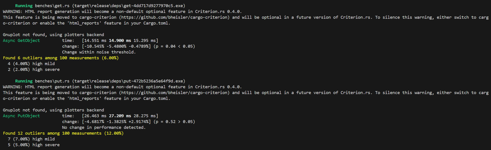
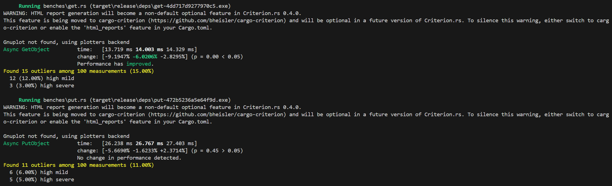
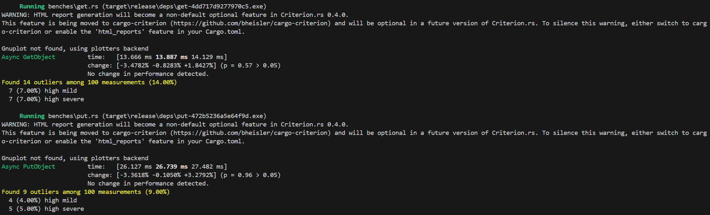
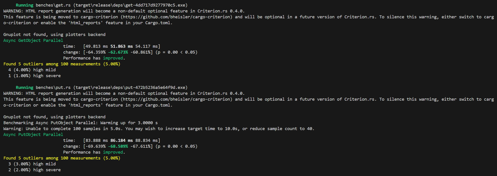
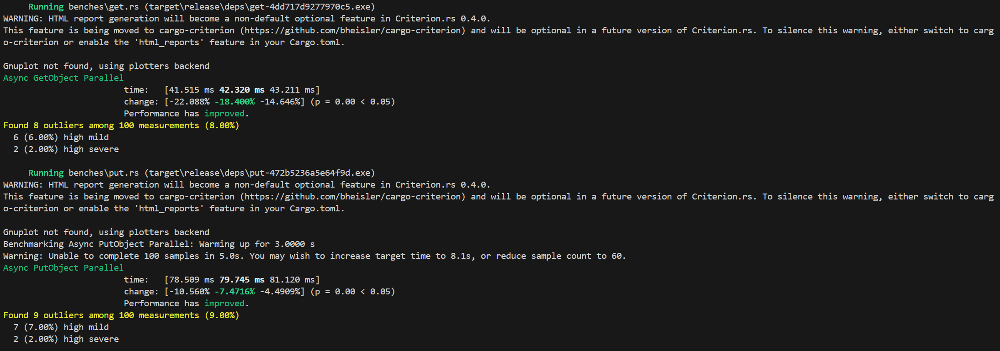
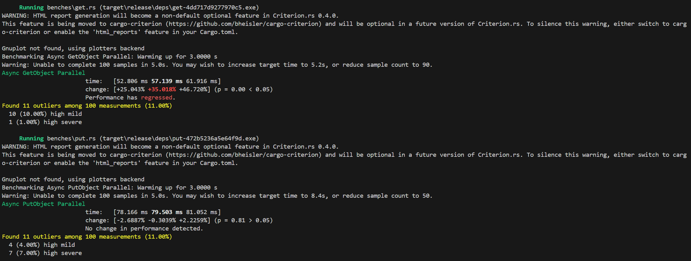
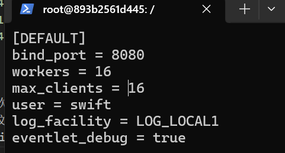
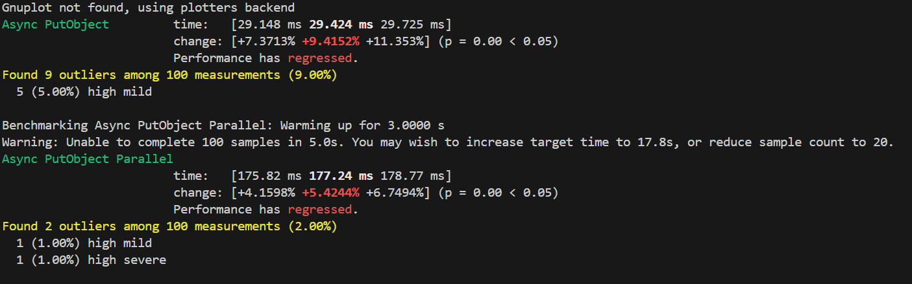
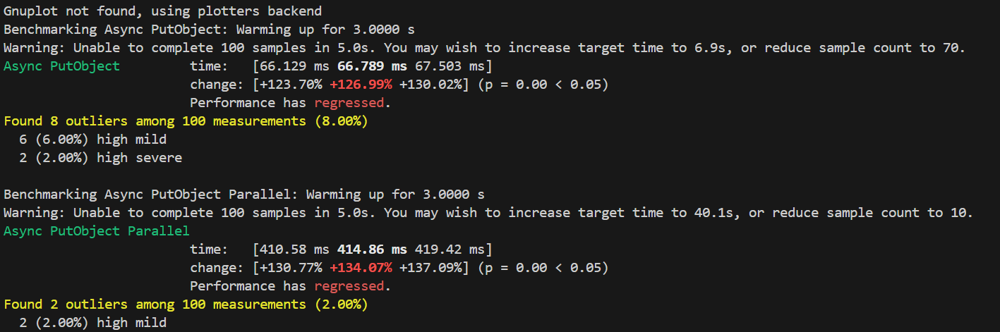
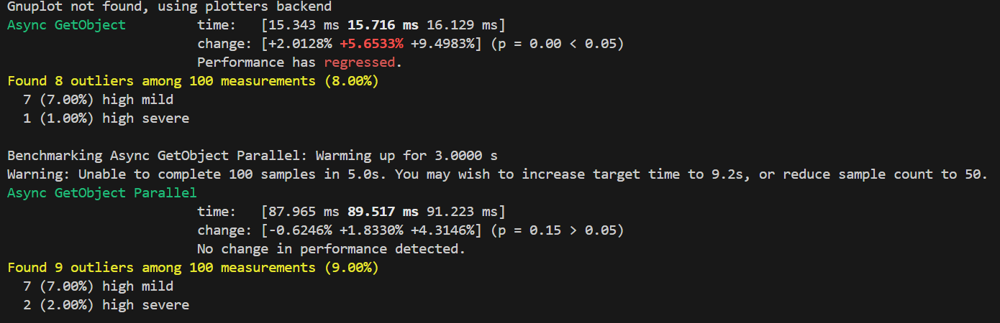

# 实验名称
***Lab 3 观测分析性能***
# 实验环境
- rust 版本：rustc 1.77.0 
- rust 依赖：
```
[dependencies]
tokio = {version = "1", features=["full"]}
aws-config = { version = "1", features = ["behavior-version-latest"] }
aws-sdk-s3 = { version = "1", features = ["behavior-version-latest"] }
rusoto_core = "0.48.0"
rusoto_credential = "0.48.0"
criterion = {version = "0.3", features = ["async_futures"]}
futures = "0.3"
futures-util = "0.3"
aws-credential-types = { version = "=1.1.5", features = ["hardcoded-credentials"] }
```
# 实验记录

## 参考资料
[criterion 基准测试官方文档](https://bheisler.github.io/criterion.rs/book/getting_started.html)

[参考程序 SKTT1Ryze / s3-bench-rs](https://github.com/SKTT1Ryze/s3-bench-rs)

## rust s3 bench 的实现
cargo new创建my_s3_benchmark，然后在Cargo.toml中添加criterion基准测试的依赖，并在Cargo.toml中添加get和put两个bench，然后再包根目录创建一个benches文件夹，在这个文件夹中创建get.rs和put.rs。
```toml
[[bench]]
name = "get"
harness = false

[[bench]]
name = "put"
harness = false
```
在get.rs和put.rs的最下方，我们都添加了如下两行代码，来使用criterion基准测试：
```rust
// 定义一个名叫 benches 的基准测试组， 其中包含 criterion_benchmark函数
criterion_group!(benches, criterion_benchmark);
// 执行 benches 组的所有基准测试
criterion_main!(benches);
```
之后我们可以复用我们在`Lab2`中rust客户端中实现的代码，将我们需要的部分复制到./src/lib.rs当中去，然后我们只需要在bench文件的开头使用`use my_s3_benchmark::create_s3_client;`就可以使用lib.rs中的方法。
之后我们需要在这两个文件当中实现分别实现各自的`criterion_benchmark`方法：
首先我们使用c.bench_function创建一个名为"Async GetObject"的测试，然后使用b.to_async将标准的同步测试转化为异步测试，然后再在异步闭包中添加需要测试的函数，这里是get，put同理。
在之后我又添加了一个Async GetObject Parallel测试，不同的是在异步闭包当中使用(0..n).map(|_| async{})同时创建多个并行的get或put操作，以实现并行的测试。
- get.rs
```rust
fn criterion_benchmark(c: &mut Criterion) {
    let rt = Runtime::new().unwrap();
    let client:Client = rt.block_on(create_s3_client(false));
    c.bench_function("Async GetObject", move |b| {
        let cli = client.clone();
        b.to_async(FuturesExecutor).iter(|| async {
            let _ret = get(&cli);
        })
    });

    let client:Client = rt.block_on(create_s3_client(false));
    c.bench_function("Async GetObject Parallel", move |b| {
        
        b.to_async(FuturesExecutor).iter(|| async {
            let futures = (0..3).map(|_| 
                async {
                    let _ret = get(&client);
                }
            );
            let _results: Vec<_> = futures_util::future::join_all(futures).await;
        })
    });
}
```
- put.rs
```rust
async fn put(client:&Client, id:i32) -> Result<PutObjectOutput, SdkError<PutObjectError>> {
    let body = ByteStream::from_path(Path::new(SOURCE_PATH)).await;
    client
        .put_object()
        .bucket(BUCKET_NAME)
        .key(format!("{}{}",OBJECT_NAME,id))
        .body(body.unwrap())
        .send().await
}

fn criterion_benchmark(c: &mut Criterion) {
    let rt = Runtime::new().unwrap();
    let client:Client = rt.block_on(create_s3_client(false));
    c.bench_function("Async PutObject", move |b| {
        let cli = client.clone();
        b.to_async(FuturesExecutor).iter(|| async {
            let _ret = put(&cli, 0);
        })
    });

    let client:Client = rt.block_on(create_s3_client(false));
    c.bench_function("Async PutObject Parallel", move |b| {
        
        b.to_async(FuturesExecutor).iter(|| async {
            let futures = (0..3).map(|i| {
                let cli = client.clone();
                    async move {
                        let id = i;
                        let _ret = put(&cli, id);
                    }
                }
            );
            let _results: Vec<_> = futures_util::future::join_all(futures).await;
        })
    });
}
```
## 测试结果分析
串行情况下的get和put测试（文件大小3.31KB）一共做了3次测试，其中每个测试会输出三个时间从左到右分别是最短用时，平均用时和最长用时：




可以发现在Get测试中，3*100次共300次测试有35次outlier离群值，其中有4+12+7=23次high mild（轻微的高离群值），约占总次数的7.67%，还有2+3+7=12次high severe（严重的高离群值），约占总次数的4%. 平均耗时14.263ms，下行速度量232.07KB/s。
而在Put测试当中，3*100次共300次测试有7+6+4=17次 high mild，约占总次数的5.67%，5+5+5=15次 high severe，约占总次数的5%. 平均耗时26.905ms，上行速度量123.03KB/s。

同时我们还进行了同时3个请求的并行测试




从输出信息中可以得知criterion自动将测试次数依然为100次，那么3次一共300次测试中：
并行3个Get操作的high mild有4+6+10=20次，约占总次数的6.67%，high severe有1+2+1=4次，约占总次数的1.333%。平均耗时50.44ms，但是其实这3次数据中明显受性能波动比较大，如果取第二次的测量结果，则下行速度为234.64KB/s。
并行3个Put操作的high mild有3+7+4=14次，约占总次数的4.67%，high severe有2+2+7=11次，约占总次数的3.67%，取平均耗时为79.62ms，则上行速度为124.72KB/s。

之后是同时6个和16个请求的并行测试，这里我们不再赘述图片中数据的含义。
详细参见[figure文件夹](./figure/)

---
在文件大小为3.31KB固定的情况下，增加并行度，每种情况分别测试300次得到的结果如表所示：
$$
\begin{array}{c|c|cc|cc}
n & \text{Runs}& \text{Put}  &   & \text{Get} & \\
\hline
 & & \text{High Mild} & \text{High Severe} & \text{High Mild} & \text{High Severe} \\
\hline
1 & 300 & 7.67\% & 4\% & 5.67\% & 5\% \\
3 & 300 & 6.67\% & 1.33\% & 4.67\% & 3.67\% \\
6 & 300 & 6.33\% & 4\% & 7.67\% & 2.67\% \\
16 & 300 & 5.33\% & 1.33\% & 4.67\% & 2.33\% \\
32 & 100 & 7\% & 0\% & NA & NA \\
128 & 100 & 0\% & 1\% & NA & NA
\end{array}
$$
虽然我们测试的次数比较少每种情况只有300次，可能于真实的结果误差比较大，但是也可以发现：在文件大小固定的情况下，随着并行度的上升，Get尾延迟发生的比例变化较小（High Mild于High Severe相加的值），但是当并行度继续增长时，尾延迟得到了有效的缓解。


这里比较令人不解的是并行之后速度并没有提升，而我再三检查了proxy-server.conf的配置也调整了其关于客户端能同时建立连接数，默认的swift进程数，也实时检测了这16个进程确实在有请求的时候对cpu的占用率都会上升，但是却没有提升或者说提升很小。
后来我发现当我增加put_testfile.txt的文件大小的时候，即使文件大小变为了54KB，为原来的16倍，并行6个put请求的平均耗时依旧为168.12 ms。和之前3.31KB时候的耗时接近。
当文件大小为216KB时，文件大小提升为了原来的64倍数时，串行上传速率只增加了2ms，并行6次上传速率也只增加了9ms。

而当我继续提高上传文件的大小到3393KB，为原来的1024倍时，耗时终于发生了显著的变化，说明已经到达了瓶颈。计算得到上行速率大概为47.92MB/s。

之后我又测试了在这个大小下读文件所需的时间（关闭了get函数中复制写入到本地的部分），发现其实依然和3.31KB时没有太大区别，而此时下行速率已经达到了226.16MB/s。

当我把文件大小设置为424MB时，时间依旧为15ms，此时的速度已经达到了几十GB/s，这时我怀疑其速度上限应该为硬盘拷贝的速度；
于是我又测试了将数据库部署在远端服务器的情况，终于，我们可以计算出从远端服务器下载速度上限为4.13MB/s而上传速度则达到了40MB/s，但是这显然是远端服务器网络上传速度和我电脑网络下载速度取较小值的结果。

此外在保持并行数为6以及串行这两种情况下，后续增大文件大小的过程测试当中，其实尾延迟的比例也并没有显著的变化，high mild和high severe的之和还是在10%左右。
# 实验小结
在本节实验当中，我测试了get和put两种操作所带来的尾延迟，以及尾延迟随并行度和文件大小带来的变化。并测试了数据库分别部署在本地docker中和服务器远端时的上传和下载速度，推测了速度上限产生的原因。