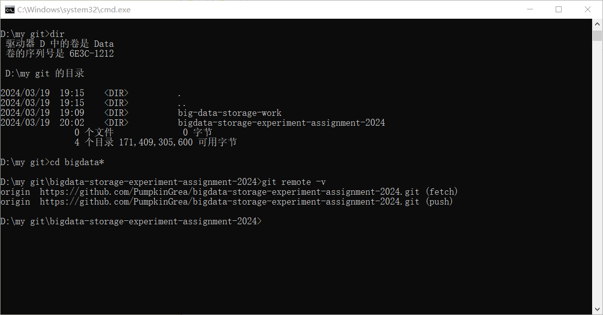

# 实验名称

Lab0 准备作业仓库

# 实验环境

Windows10操作系统（Ubuntu18.04模拟的Linux环境）

# 实验记录

将作业仓库fork到了本地，并与gihub个人账号的作业仓库建立链接

同时对于作业库的文件格式进行了初始化

# 实验小结

在github上创建了自己的作业仓库，按照要求完善了作业库的格式，后续实验将使用Ubuntu在Linux环境下完成并运行。
