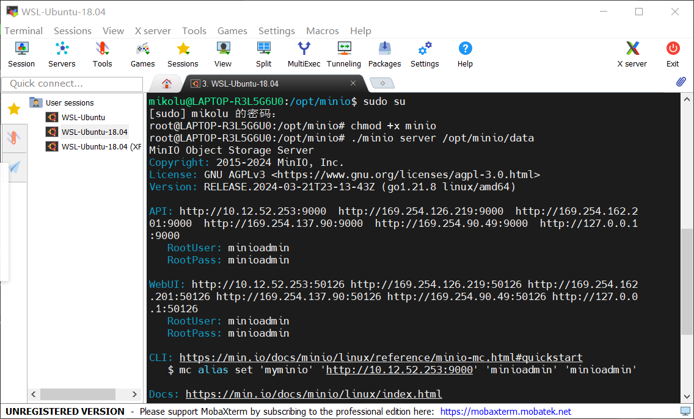
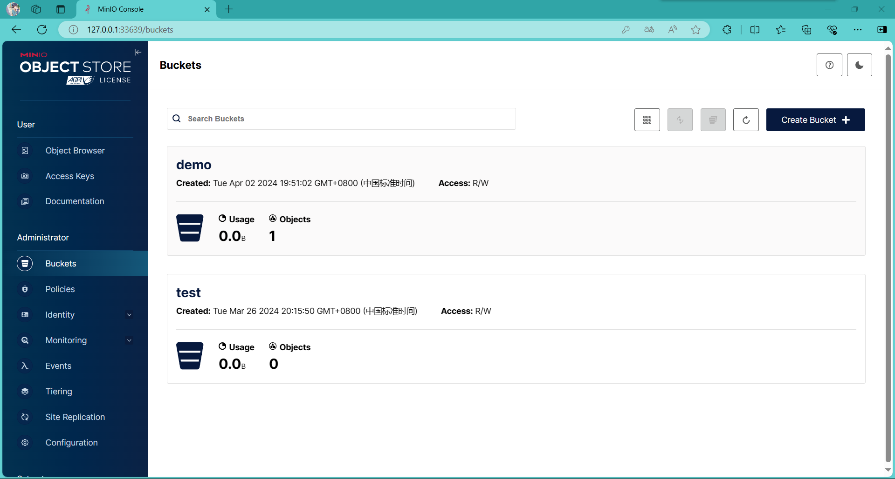

# 实验名称

Lab1 搭建对象储存

# 实验环境

WSL-Ubuntu-18.04

# 实验记录

## 实验1-1：搭建minio服务端

下载minio并配置系统路径及文件权限后直接启动

可以看到如上图的启动信息

包含API端口（默认9000）

以及webUI端口，该端口每次启动都是随机的值，为了固定该端口，我们修改启动命令

.png)

由于启动指令较长，我们将其写入脚本文件startminio.sh

直接运行该脚本，查看进程发现已启动

使用脚本启动固定了端口号为33639，并且将启动日志写入.log启动日志文件，避免了在命令行输出大段冗杂语句

打开启动日志文件minio.log

可以看到端口号已经被固定为了33639

## 实验1-2：查看并测试minio服务端

我们通过webUI地址（即本机回环地址127.0.0.1）和端口号33639访问浏览器

输入账号密码登录后可以实现webUI管理服务端

我们可以通过webUI来创建和删除储存桶及文件

# 实验小结

在Minio的搭建过程中遇到了一些小问题，每次启动的端口都不相同，为了解决该问题，我查阅了相关资料，改变启动参数，指定端口后台启动，并将该长指令写入运行脚本中，方便后续启动。
