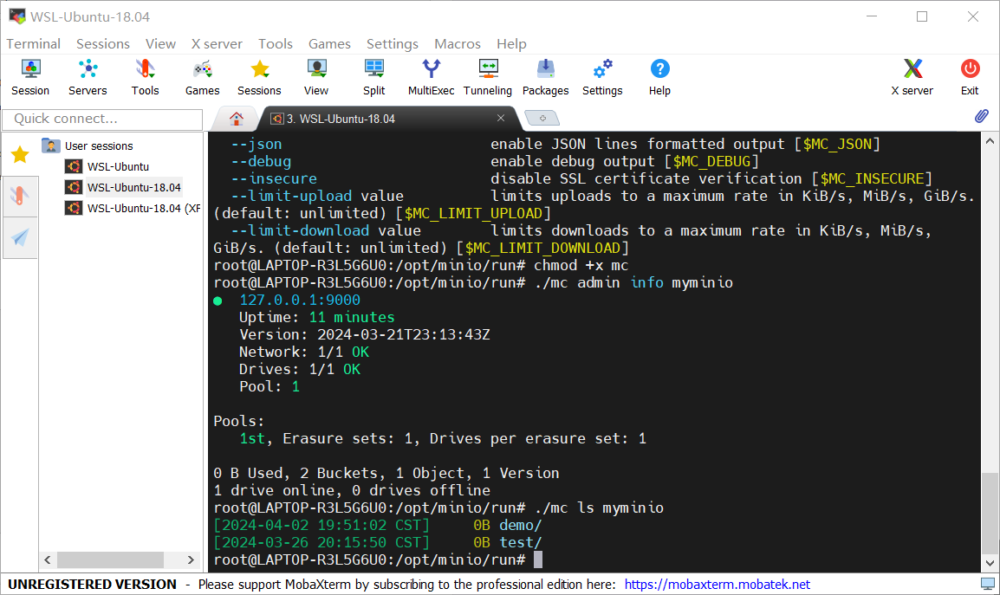
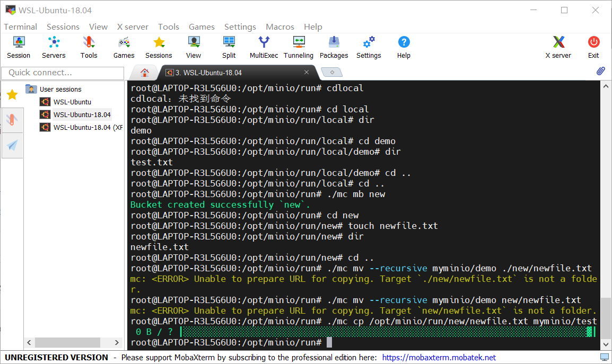
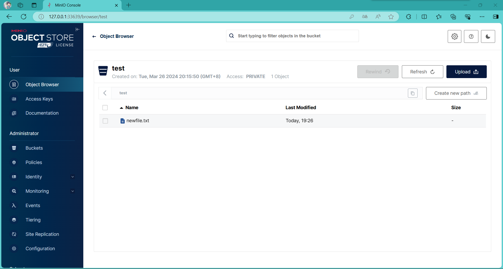
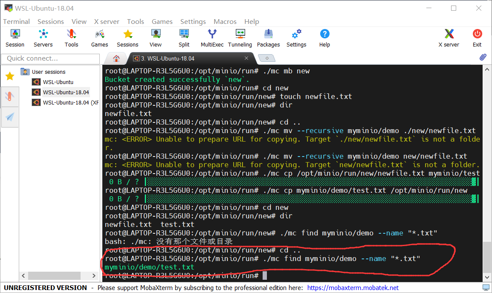
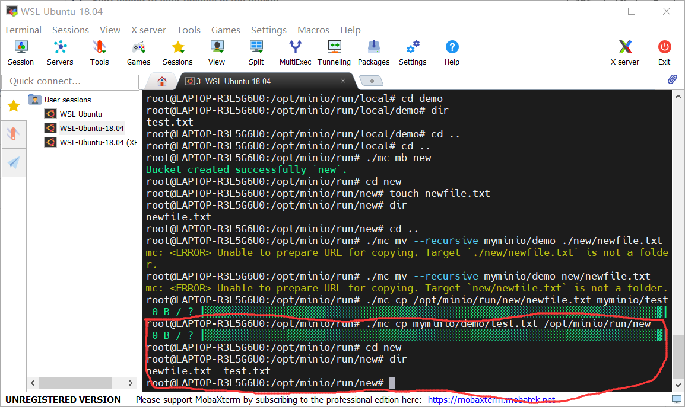

# 实验名称

Lab2 实践基本功能

# 实验环境

WSL-Ubutun-18.04

# 实验记录

## 实验2-1：搭建minio客户端

首先通过命令行指令下载并安装了minio客户端

通过服务端的API端口连接到了服务端

使用ls指令查看我们之前通过webUI创建的两个桶

通过mb指令在客户端创建一个新的桶new，并在本地touch一个txt文件

通过mv指令将其上传至我们之前创建的桶test内

通过webUI查看我们上传的结果，新文件newfile.txt已经上传至服务端test桶

通过find指令查找测试服务端时创建的桶demo中所有.txt后缀文件，找到测试文件test.txt

使用cp指令将服务端demo桶内的test.txt文件拷贝到本地桶new中

查看桶内文件，有newfile.txt和test.txt两个文件

至此，完成了对于客户端增删改查的功能测试

# 实验小结

Minio Client的搭建还是较为容易的，通过阅读官方文档很快便实现了相关操作，较为顺利。
