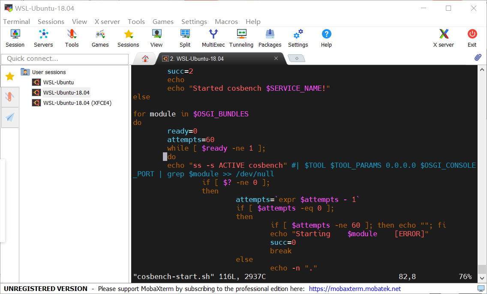
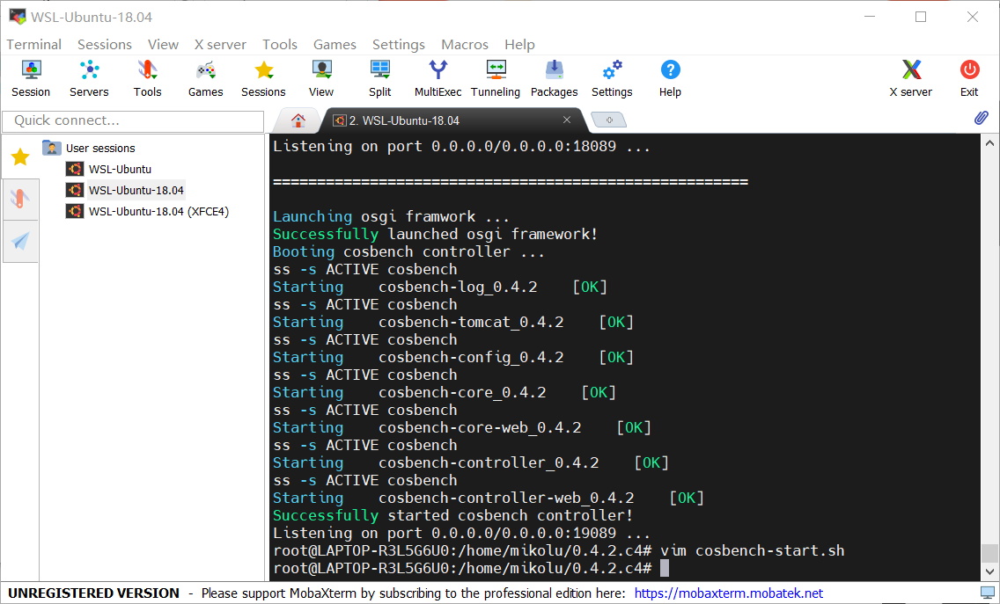
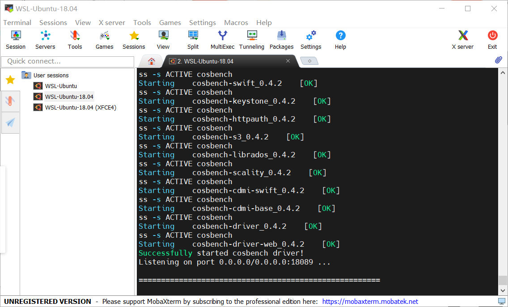
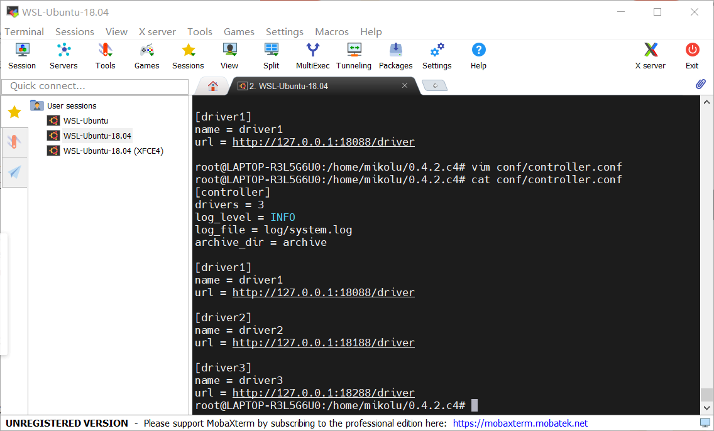
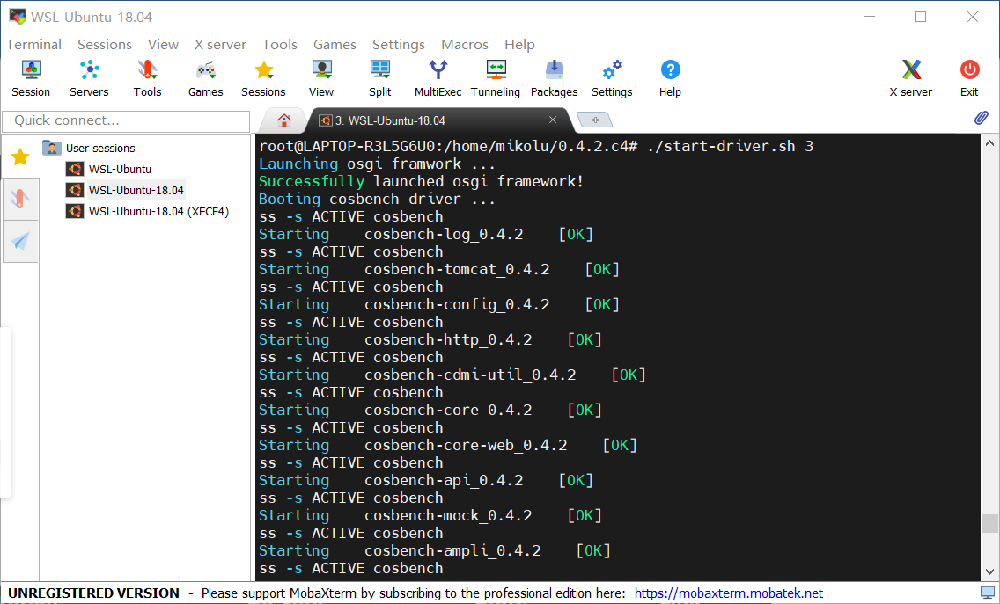
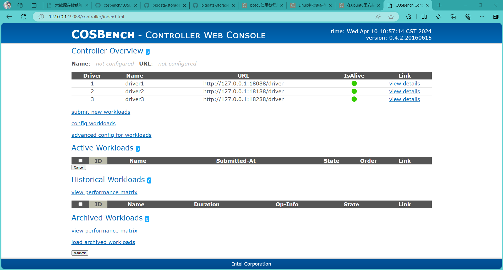
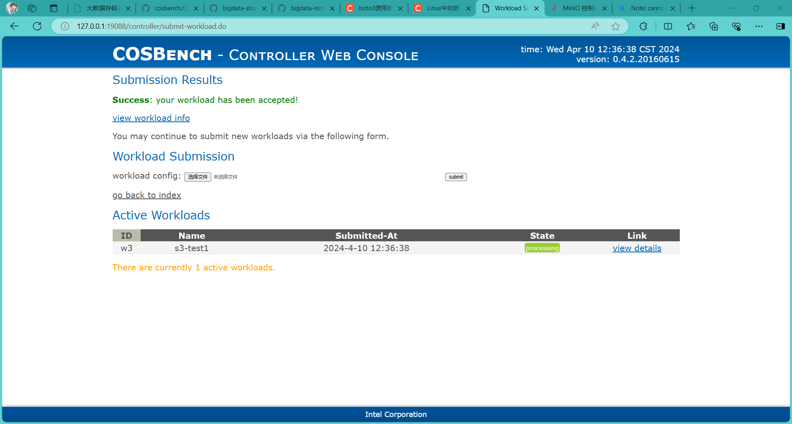
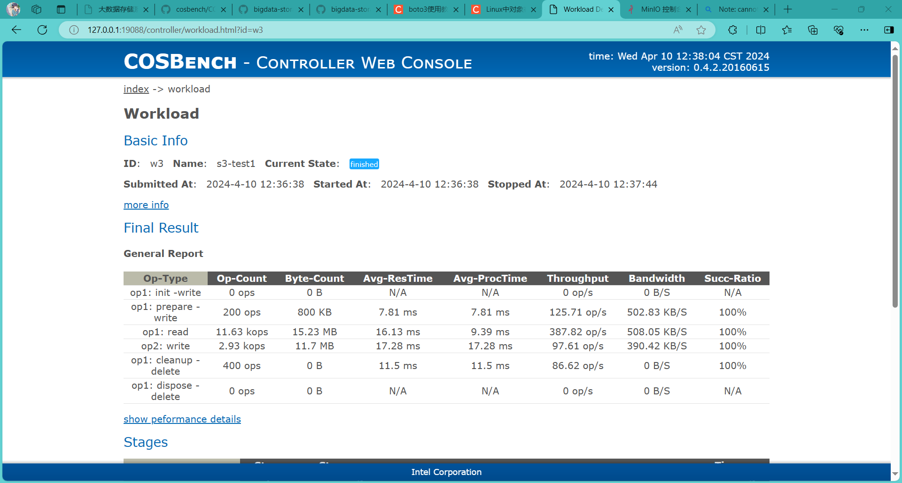

# 实验名称

Lab3 数据分析测试

# 实验环境

WSL-Ubuntu18.04

# 实验记录

## 实验3-1：配置cosbench

获取cosbench到本地，配置java环境，启动controller和driver

启动脚本出现了一些问题，在启动controller时卡住，但是本人对于shell语言并不是很了解

通过查阅资料并进行了一定的尝试后，修改了其中的一些语句

修改后启动成功

为了对搭建的存储系统进行更好的测试，这里选择启动多个driver

修改controller.conf文件，并为设定的三个driver分别给定不同端口

从而模拟不同的设备连接

通过cosbench的webUI可以看到，三个driver均启动成功

接下来我们编写测试脚本

脚本内容见assets文件内容

分别测试读写删等功能

测试信息如上，可以看到，读写成功率都是100%

读操作的速度明显要小于写操作

设置的work main次数较多，有8次，由三个driver共同进行

其他几个work部分均由driver1进行

# 实验小结

测试结束后这次实验也完全结束了，对于初次接触这种大数据存储系统的我是收获颇丰，希望以后有机会可以尝试更难的内容。
