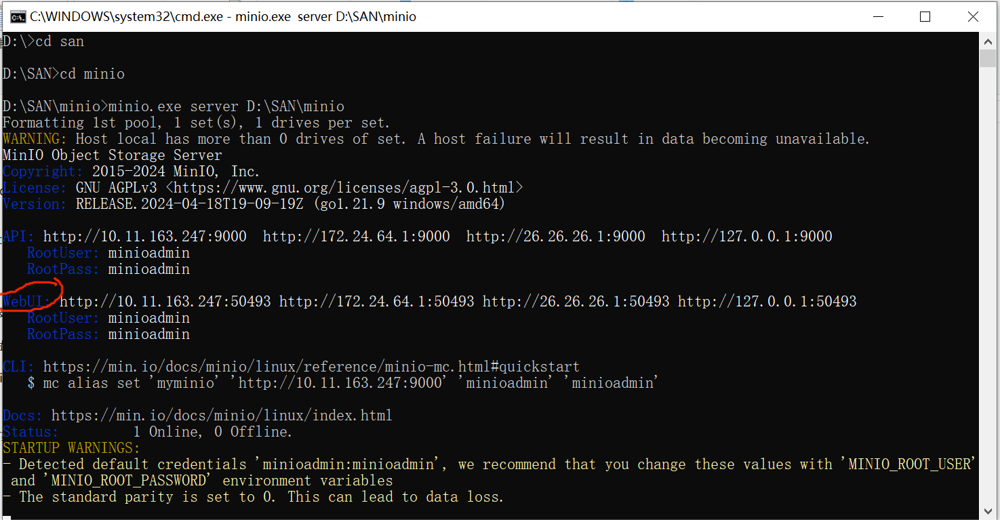
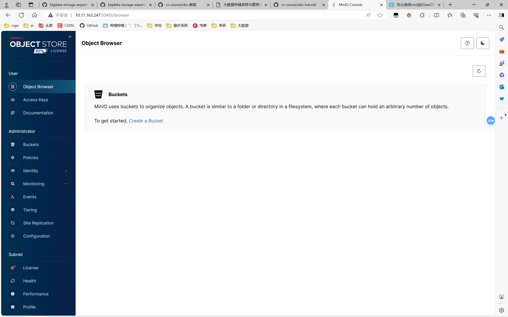
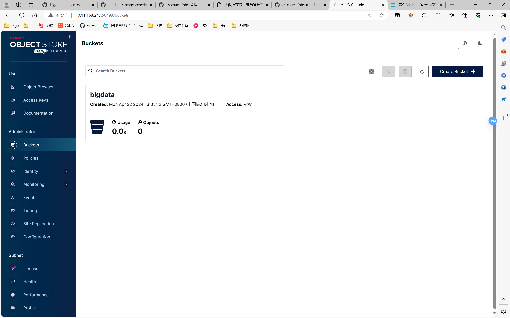

# 实验名称
Lab1搭建对象存储
# 实验环境
```
Microsoft Window 10 
Git-2.44.0-64-bit.exe
Visual Studio Code1.88.1.0
minIO server
```
# 实验记录
第一步：环境安装与设置

在官网下载minIO Server.exe和mc.exe

第二步：用命令行运行

在存放minio.exe的文件夹中打开cmd并运行指令 `minio.exe server filepath`

其中，使用真实存放minio.exe的文件路径替换代码中的`filepath`；

第三步：执行

在第二步的运行结果中找到WebUI行，其提供了网址，登入用户名及密码



选择其中一个网址，并复制到浏览器中打开。


输入用户名及密码进入，成功进入即访问正常。



创建一个新桶（bigdata）用于后续测试


# 实验小结
初步了解了对象存储技术，实现了对象存储的服务器端。
