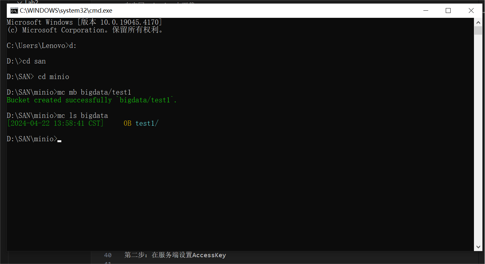
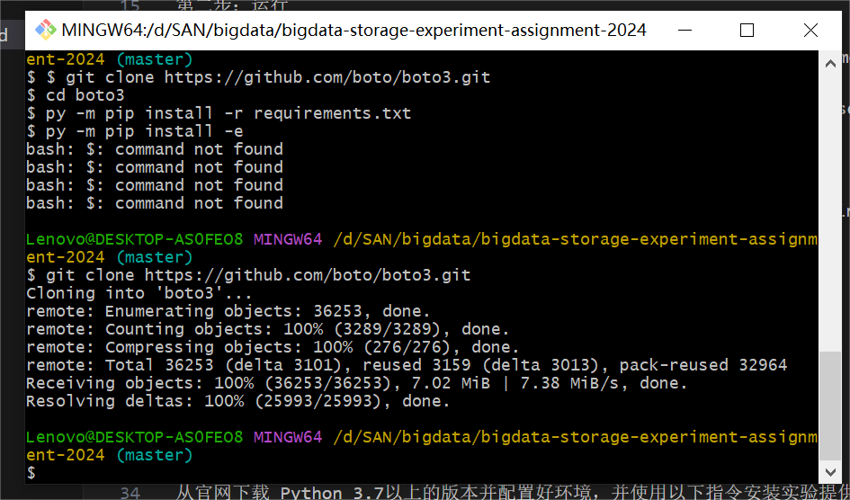
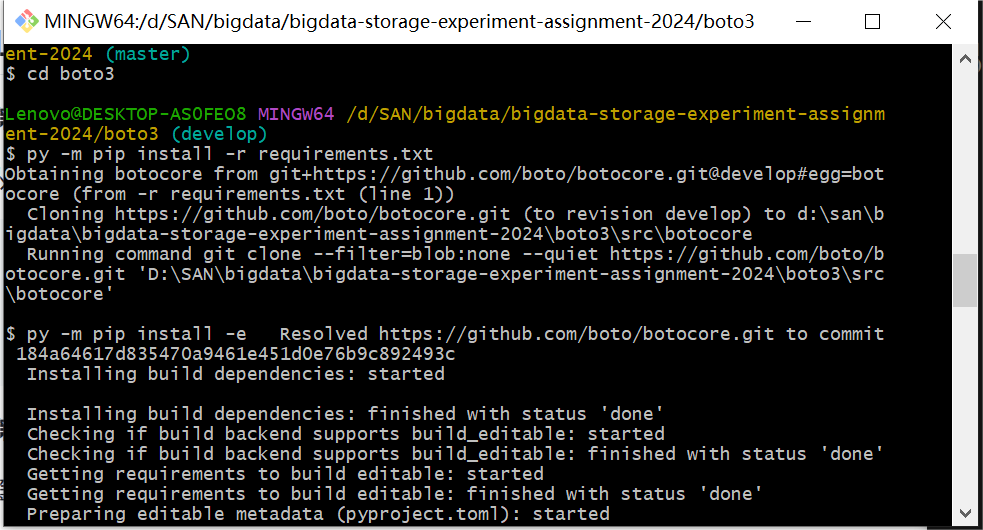
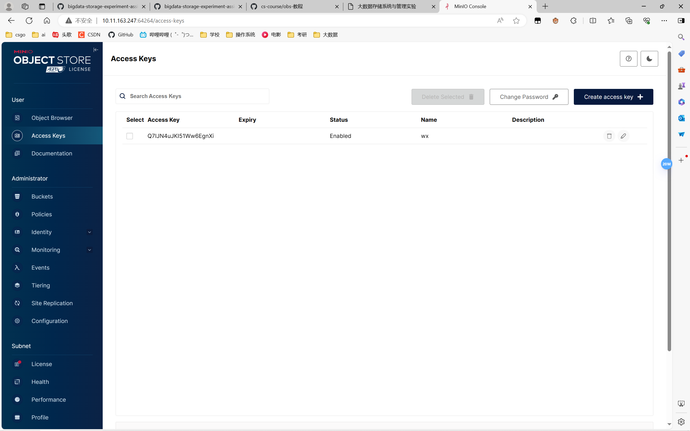

# 实验名称
Lab2实现基本功能
# 实验环境
```
Microsoft Window 10 
Git-2.44.0-64-bit.exe
Visual Studio Code1.88.1.0
Server	minIO Server
Client	boto3 & mc
Enviroment	python 3.12
```
# 实验记录
## Lab 2-1 : Client - mc
### 第一步：环境安装

在官网 min.io 中下载 mc

### 第二步：运行

在 mc.exe 的文件中打开新的cmd，运行 `mc alias set name webUI username password `

其中，使用真实 webUI 以及用户名和密码(Lab1中获取的信息)替代 webUI，username 和 password

name是为存储服务器创命的名

带入后我的命令为`mc alias set bigdata http://10.11.163.247:50493 minioadmin minioadmin`

运行 `mc mb bigdata/test1`创建新的桶 test1

运行 `mc ls bigdata` 列出服务器中所有的桶

运行 `mc rb bigdata/test1` 删除桶 test1 

这里出现了报错，但是经检查正确删除了桶 test1，实现了删除的功能，报错原因暂不明确。

## Lab 2-2 : Client - boto 3 wif python
### 第一步：环境安装

从官网下载 Python 3.7以上的版本并配置好环境，并使用以下指令安装实验提供的boto资源
```
    $ git clone https://github.com/boto/boto3.git
    $ cd boto3
    $ py -m pip install -r requirements.txt 
    $ py -m pip install -e 
```

下载完成后是这样


### 第二步：在服务端设置AccessKey

登入minIO Server 设置并保存好 AccessKey & SecretKey，可以直接下载Key以免遗忘。



### 第三步：编写python代码文件

`test.py`

利用其测试服务端和客户端的连接。其中要把代码段中的access_key和secret_key修改成与上一步生成的一致。连接成功建立时程序会打印出服务端里的所有桶的名字

`CRUD.py`

对minIO Server里的桶和对象进行增删改读等一系列系列操作

# 实验小结
使用 mc 和 boto3 minIO Server 进行了基本的操作，掌握了 minIO Server 的基础操作。