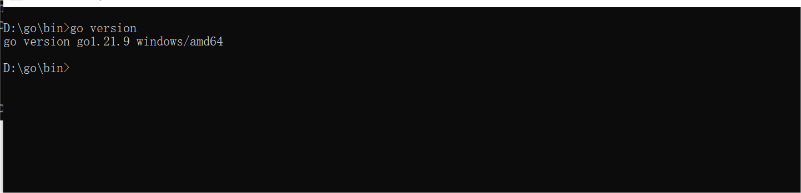
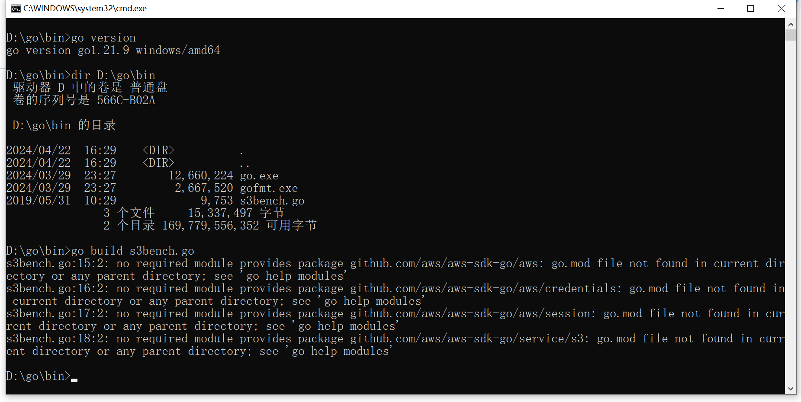
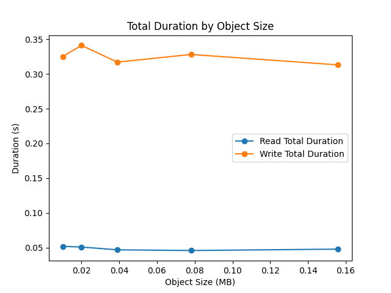
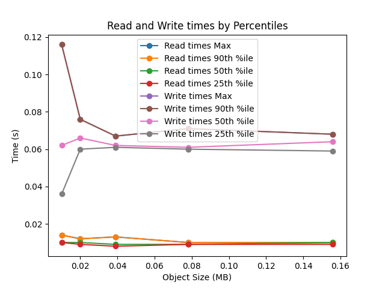

# 实验名称
Lab3观测性能分析
# 实验环境
```
Microsoft Window 10 
Git-2.44.0-64-bit.exe
Visual Studio Code1.88.1.0
Server	minIO Server
Client	boto3 & mc
Enviroment	python 3.12 & s3bench
```
# 实验记录
## Lab 3-1 : 测试
### 第一步：环境安装

在官网下载 GO 语言，检查版本号。



使用`go install github.com/igneous-systems/s3bench@latest `安装 s3bench

验证是否安装成功


### 第二步：执行测试
使用Lab2的python程序创造test-bucket数据桶


使用以下 s3bench 指令对 minIO 中的 loadgen 桶进行测试
```
s3bench -accessKey=test:tester -accessSecret=testing -bucket=testbucket -endpoint=http://localhost:12345 -numClients=2 -numSamples=10 -objectNamePrefix=loadgen -objectSize=1024 -region=us-east-1
```
在指令结尾加上 `>filepath\file.filetype` 可保存执行结果到 filepath\file.filetype。结果如下
```
endpoint(s):      [http://localhost:12345]
bucket:           test-bucket
objectNamePrefix: loadgen
objectSize:       0.0010 MB
numClients:       2
numSamples:       10
verbose:       %!d(bool=false)


Generating in-memory sample data... Done (0s)

Running Write test...

Running Read test...

Test parameters
endpoint(s):      [http://localhost:12345]
bucket:           test-bucket
objectNamePrefix: loadgen
objectSize:       0.0010 MB
numClients:       2
numSamples:       10
verbose:       %!d(bool=false)


Results Summary for Write Operation(s)
Total Transferred: 0.010 MB
Total Throughput:  0.03 MB/s
Total Duration:    0.296 s
Number of Errors:  0
------------------------------------
Write times Max:       0.061 s
Write times 99th %ile: 0.064 s
Write times 90th %ile: 0.062 s
Write times 75th %ile: 0.061 s
Write times 50th %ile: 0.060 s
Write times 25th %ile: 0.059 s
Write times Min:       0.053 s


Results Summary for Read Operation(s)
Total Transferred: 0.010 MB
Total Throughput:  0.29 MB/s
Total Duration:    0.036 s
Number of Errors:  0
------------------------------------
Read times Max:       0.008 s
Read times 99th %ile: 0.008 s
Read times 90th %ile: 0.008 s
Read times 75th %ile: 0.007 s
Read times 50th %ile: 0.007 s
Read times 25th %ile: 0.006 s
Read times Min:       0.006 s

Cleaning up 10 objects...
Deleting a batch of 10 objects in range {0, 9}... Succeeded
Successfully deleted 10/10 objects in 151.4718ms
```
完成测试后通过修改命令行对应参数进行实验：
```
D:\go1.21.9.windows-amd64\GO项目\library\bin> s3bench -accessKey=test:tester -accessSecret=testing -bucket=test-bucket -endpoint=http://localhost:12345 -numClients=2 -numSamples=10 -objectNamePrefix=loadgen -objectSize=1024 -region=us-east-1 >test_objectsize_1024.txt

D:\go1.21.9.windows-amd64\GO项目\library\bin> s3bench -accessKey=test:tester -accessSecret=testing -bucket=test-bucket -endpoint=http://localhost:12345 -numClients=2 -numSamples=10 -objectNamePrefix=loadgen -objectSize=2048 -region=us-east-1 >test_objectsize_2048.txt

D:\go1.21.9.windows-amd64\GO项目\library\bin> s3bench -accessKey=test:tester -accessSecret=testing -bucket=test-bucket -endpoint=http://localhost:12345 -numClients=2 -numSamples=10 -objectNamePrefix=loadgen -objectSize=4096 -region=us-east-1 >test_objectsize_4096.txt

D:\go1.21.9.windows-amd64\GO项目\library\bin> s3bench -accessKey=test:tester -accessSecret=testing -bucket=test-bucket -endpoint=http://localhost:12345 -numClients=2 -numSamples=10 -objectNamePrefix=loadgen -objectSize=8192 -region=us-east-1 >test_objectsize_8192.txt

D:\go1.21.9.windows-amd64\GO项目\library\bin> s3bench -accessKey=test:tester -accessSecret=testing -bucket=test-bucket -endpoint=http://localhost:12345 -numClients=2 -numSamples=10 -objectNamePrefix=loadgen -objectSize=16384 -region=us-east-1 >test_objectsize_16384.txt
```
## Lab 3-2 : 观测对象大小对性能的影响
### 测试目的
对象大小对存储性能的影响

### 测试分析
当观测对象大小对性能影响时，需要关注读写延迟、吞吐量、CPU使用率、内存使用、磁盘I/O、网络指标、系统负载、错误与超时率以及缓存命中率这些数据和指标。通过收集和分析上述数据和指标，我们可以更全面地了解对象大小对系统性能的影响，并找出潜在的性能瓶颈或优化机会。
使用python画图程序绘制数据oversize的图像如下。




分析图像可知，吞吐率和延迟是性能的两个关键指标。一般而言，吞吐率高的系统性能好，而延迟低则表示响应更快。但在我们的实验中，对象大小对吞吐率和延迟的影响并不总是一致的。例如，1024MB大小的对象在读吞吐率上有所提高，但读延迟也显著增加。

根据实验结果，针对不同的应用场景和性能需求，可能需要采取不同的优化策略。例如，对于需要高吞吐率的应用，可以考虑使用小到中等大小的对象；而对于需要低延迟的应用，可能需要优化大对象的处理机制。

本次实验仅以读写延迟及吞吐率为反应性变数，对性能影响进行观察与分析。

# 实验小结
使用S3bench对服务器进行性能的测试，将数据整理绘图进行分析。
