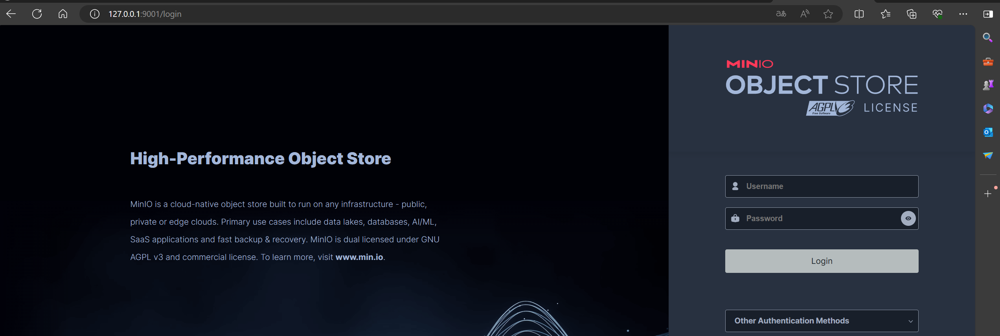
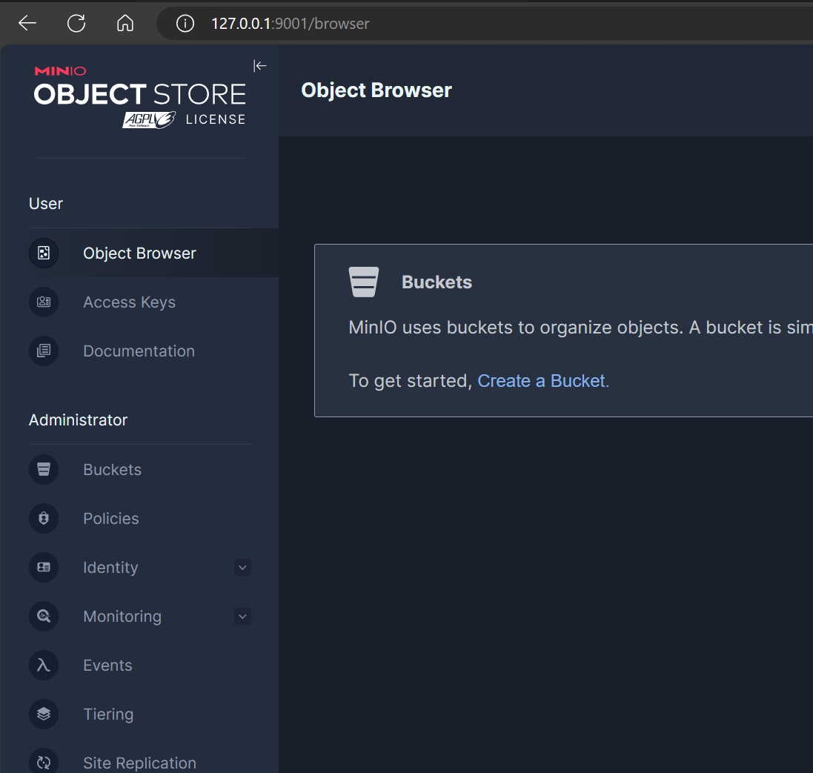
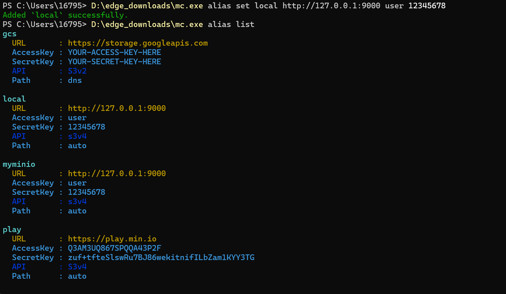
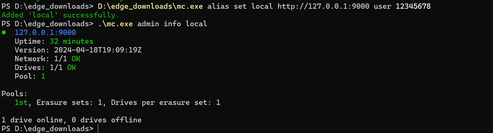

# 实验名称 搭建对象存储

# 实验环境
Windows系统，MinIo

# 实验记录
在官网分别下载mc.exe和minio.exe
## 实验1-1：搭建服务器
设置MINIO_ROOT_USER，MINIO_ROOT_PASSWORD，使用命令‘.\minio.exe server C:\minio --console-address :9001’来启动minio.exe。

## 实验1-2：使用浏览器访问服务器
打开浏览器访问"127.0.0.1:9001".

输入MINIO_ROOT_USER，MINIO_ROOT_PASSWORD登录：

## 实验1-3：搭建客户端
使用命令'./mc.exe alias set local http://127.0.0.1:9000 MINIO_ROOT_USER MINIO_ROOT_PASSWORD'来启动mc.exe，并设置机器别名等。

使用命令"mc.exe admin info local"来观察连接情况。

# 实验小结

依照文档使用minio搭建服务器和客户端并连接访问。

