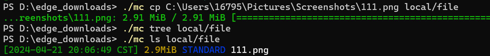
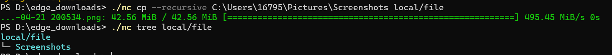
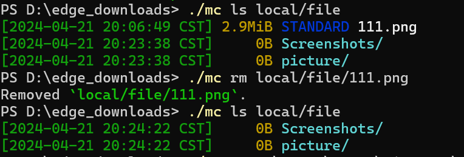
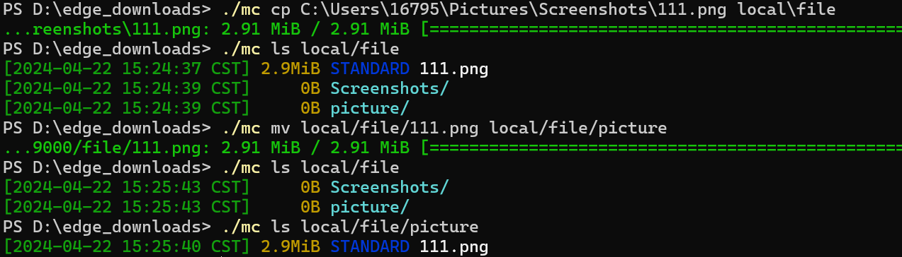
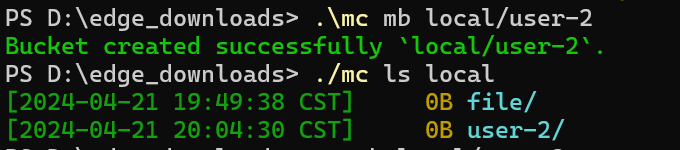
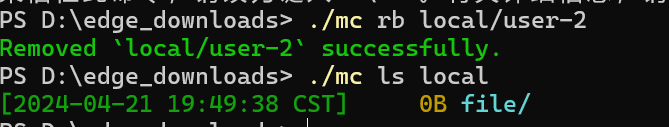

# 实验名称 实践基本功能

# 实验环境
Windows系统

# 实验记录
使用mc客户端操作服务器

## 实验2-1：文件的上传
使用cp命令上传文件：

使用cp --recursive递归上传文件夹：

## 实验2-2：文件的删除
使用rm命令删除文件：

## 实验2-3：文件的更改
使用mv命令移动文件：

## 实验2-4：桶的新建和删除
使用mb命令新建桶：

使用rb命令删除桶：

# 实验小结
通过mc客户端对服务器进行了新建，删除，上传，更新等操作。