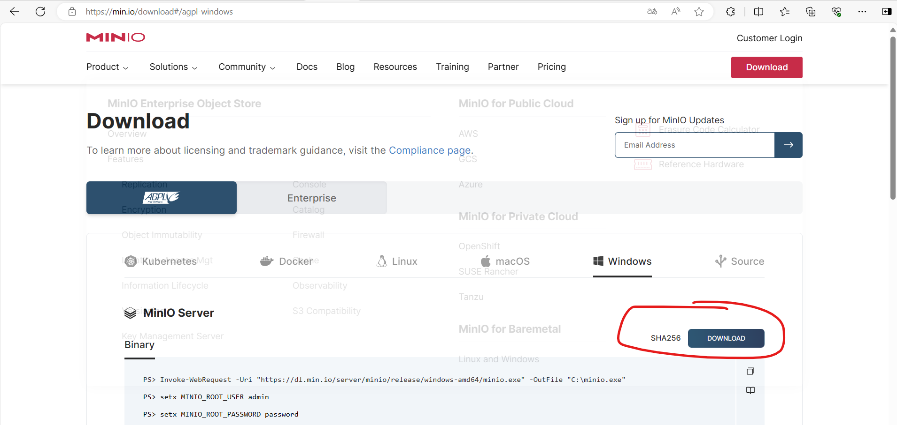
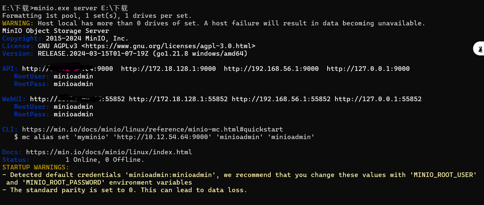
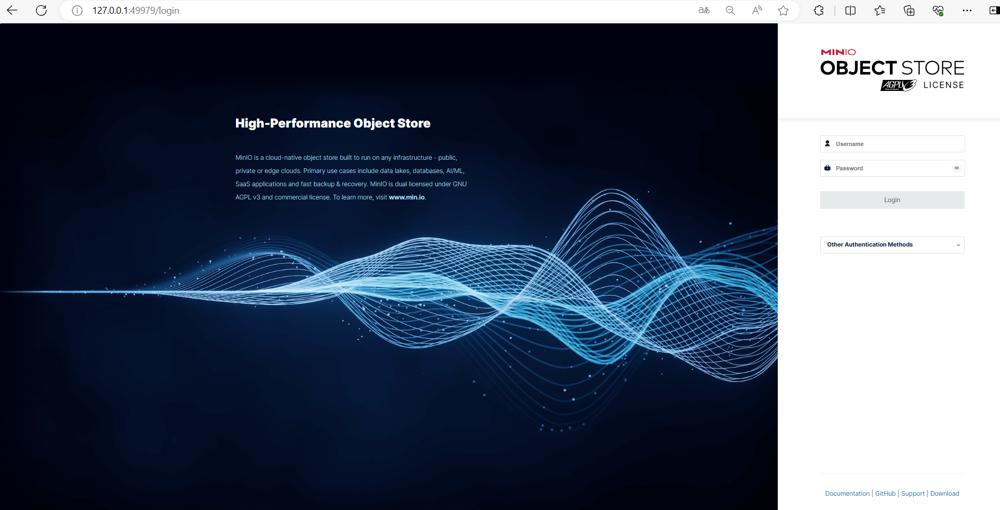
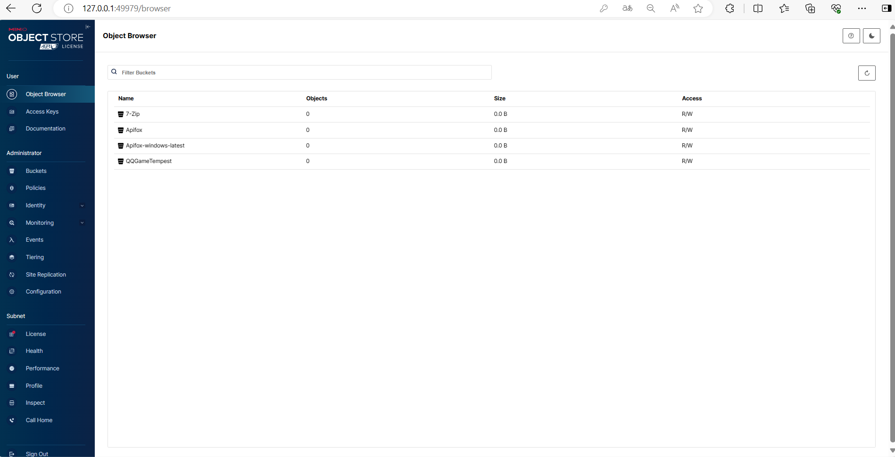

# 实验名称

搭建对象存储

# 实验环境

| 操作系统 | Windows 11 专业版                                          |
| ---------- | ------------------------------------------------------------ |
| 处理器   | AMD Ryzen 5 4600U with Radeon Graphics            2.10 GHz |
| 内存     | 16G                                                        |
| 服务器端 | MinIO Server  && mock_s3 Server                           |
| 系统类型 | 64 位操作系统, 基于 x64 的处理器                           |

# 实验记录

## 实验lab1

### Minio Server服务端的搭建

1. 直接在Minio官网下载Minio Server的windows版本

   
2. 进入minio.exe存放路径，打开cmd, 输入命令 `minio.exe  server path`,path是minio.exe所在的文件路径

   
3. 复制一个WebUI，在浏览器中打开，然后输入用户名和密码，`minioadmin`,进入Minio Server界面。
4. 界面如下：（Minio Server会把与minio.exe同目录下的文件夹初始化为空桶）

   

### mock-s3服务端的搭建

1. 首先将用Python重写fake-s3模仿Amazon S3的mock-s3的仓库克隆到本地
   `git clone https://github.com/ShiZhan/mock-s3`
2. 然后就可以根据文档介绍，直接进入mock_s3目录，在`9000`端口启动服务端
   `python main.py --hostname 0.0.0.0 --port 9000 --root ./root`，运行截图如下：

# 实验小结
