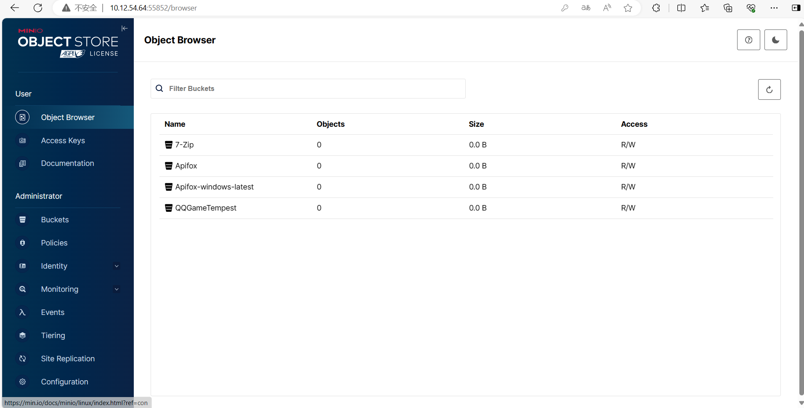
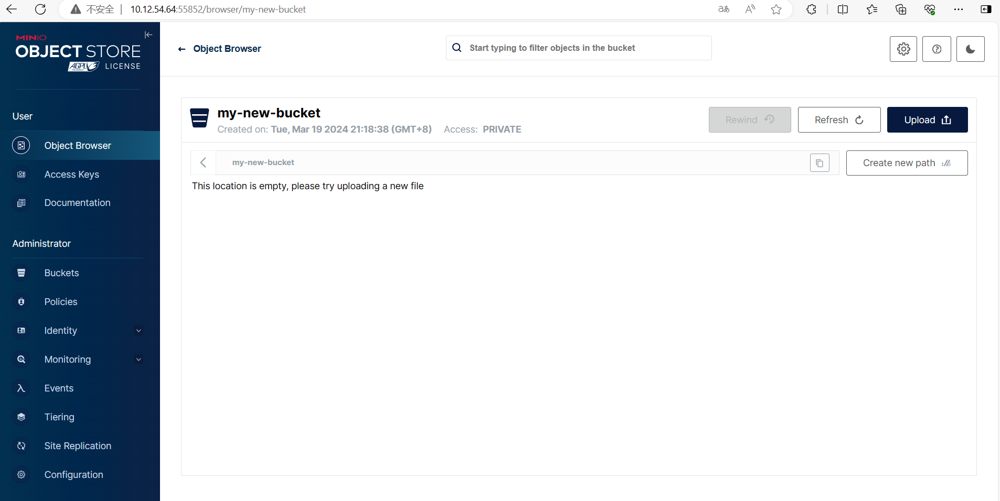
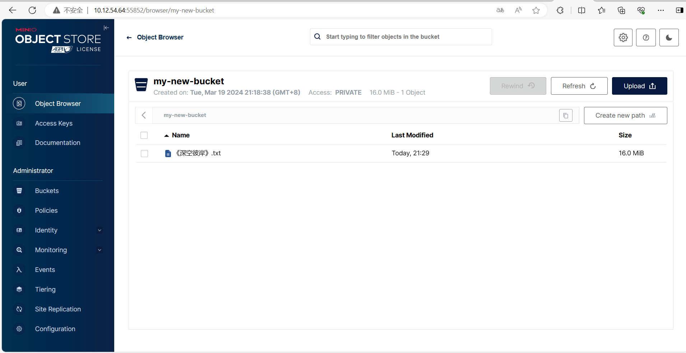
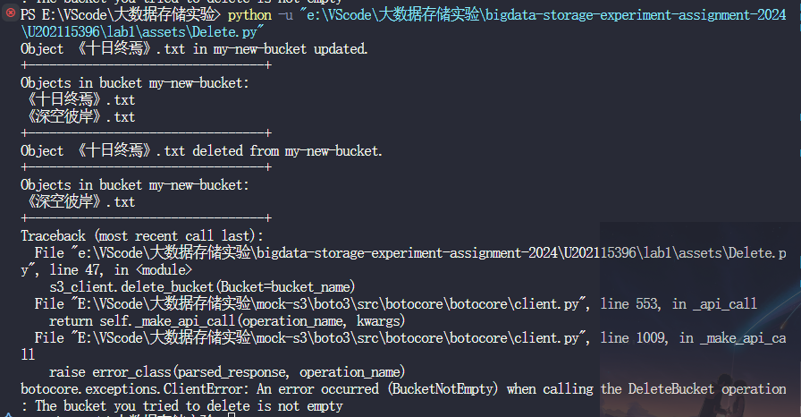

# 实验名称

实践基本功能

# 实验环境


| 操作系统 | Windows 11 专业版                                          |
| ---------- | ------------------------------------------------------------ |
| 处理器   | AMD Ryzen 5 4600U with Radeon Graphics            2.10 GHz |
| 内存     | 16G                                                        |
| 服务器端 | MinIO Server                                               |
| 系统类型 | 64 位操作系统, 基于 x64 的处理器                           |
| 客户端   | Boto3                                                      |

# 实验记录

## 实验lab2

1. 根据实验文档提供的Boto3源代码安装
   ```
   $ git clone https://github.com/boto/boto3.git
   $ cd boto3
   $ python -m pip install -r requirements.txt
   $ python -m pip install -e .
   ```
2. 建立Boto3客户端和Minio Server的连接
   1. 首先启动Minio Server
   2. 创建Minio Server的Access Keys,

      
   3. 修改test.py中的access_key,secret_key为自己创建好的密钥，同时修改endpoint_url为Minio Server正在运行的网址，然后就可以运行，从而测试客户端和服务端是否能够正确建立连接，如果能够正常建立连接，程序会打印出所有的存储桶。
3. Minio Server初始状态



4. 使用Create.py程序创建了一个新的存储桶`my-new-bucket`


5. `my-new-bucket`存储桶在更新前是一个空桶。



6. Update.py程序向`my-new-bucket`桶上传了一个文件`《深空彼岸》.txt`，其中object_key可以自行设置，但要保证不重复原则。



7. Read.py——读取：获取存储桶中的对象列表


8. Delete.py ——初始的时候，我又上传了一个新的文件，然后删除，这个时候再删除桶的时候发现报错——即如果桶不为空，则无法删除：



9. 更改删除代码——删除桶的所有文件，成功删除桶


# 实验小结

成功建立了客户端和服务端之间的联系，实现了客户端通过不同的API对服务端的四种基本操作——Create，read，update，delete。同时发现，当存储桶不为空的时候，无法直接删除。
