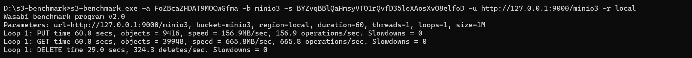
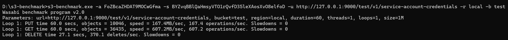

# 实验名称

观测分析性能

# 实验环境

windows11操作系统

# 试验记录

使用s3-benchmark进行测试，测试结果一：

### 第一个桶的性能结果（图1）

- PUT 性能：
  - 时间：60.0 秒
  - 对象：3916
  - 速度：65.3 MB/sec
  - 操作速度：65.3 操作/秒
- GET 性能：
  - 时间：60.0 秒
  - 对象：3916
  - 速度：165.9 MB/sec
  - 操作速度：65.3 操作/秒
- DELETE 性能：
  - 时间：29.0 秒
  - 删除速度：324.3 删除/秒

测试结果二：

### 第二个桶的性能结果（图2）

- PUT 性能：
  - 时间：60.0 秒
  - 对象：3645
  - 速度：60.7 MB/sec
  - 操作速度：60.7 操作/秒
- GET 性能：
  - 时间：60.0 秒
  - 对象：3645
  - 速度：167.0 MB/sec
  - 操作速度：60.7 操作/秒
- DELETE 性能：
  - 时间：27.1 秒
  - 删除速度：370.1 删除/秒

# 实验小结

在本次实验中使用s3-benchmark测试工具，对minIO数据库中的两个桶进行测试。

