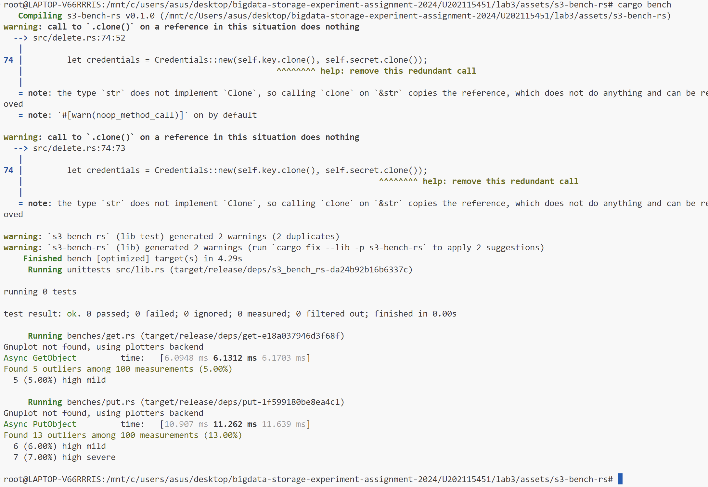

# 实验名称

性能分析

# 实验环境

Unbantu 20.04默认发行版

# 试验记录

## 实验 运行s3-bench-rs

1. ppt中给出的s3-bench-rs是三年前的库了，其中有个crate rust-s3更新了很多版，接口发生过更改，已无法正常使用，不过好在作者当时提交过pull request到rust-s3，所以可以使用`git reset 8e41`来回退到当时的版本，这是最简单的方法。
2. 还有一种就是修改s3-bench-rs的代码，首先需要在cargo.toml中添加`rust-s3 = "0.5.0"`，这样可以自动拉取最新版的rust-s3。因为新版的rust-s3的`Bucket::new()`加了参数生命周期的限制，传参时不能使用`&str`类型的参数，对于`&str`需要转化为String，以及`Bucket::new()`的第二个参数从`bool`改为了`UrlStyle`，也需要相应修改。故先需要将文件引用部分的内容先修改 ，修改后的引用如下：
   
   ```
   use rusty_s3::{actions::GetObject, Bucket, Credentials, S3Action, UrlStyle};
   ```
   
   修改后的`Bucket::new()`如下：
   
   ```
   let bucket = Bucket::new(self.endpoint.clone(), UrlStyle::Path, bucket.to_string(), self.region.clone()).unwrap();
   ```


   服务端使用minio server，运行结果如下：


# 实验小结

在本次实验中对版本不同问题进行了详细的调试，更加深刻认识了数据存储中版本管理的重要性。

