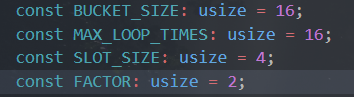
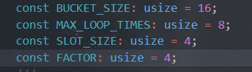
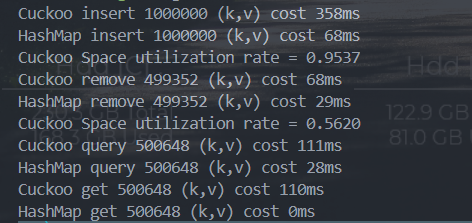

# 实验名称
    Cuckoo Hash
# 实验环境
    Windows10 
    Rust 1.79.0-nightly
# 实验记录
## 项目目录
*   cuckoo
    *   benches
        *   insert_bench.rs
    *   src
        *   cuckoo.rs (implement)
        *   lib.rs (test)
        *   bin/main.rs (example)
## 实验过程
    1. 选用双桶四路CuckooHash
    2. 确定Hash函数,快速且分布均匀最佳,选用FnvHash和SipHash
    3. 参照Rust HashMap API实现 insert,remove,contains_key,get等基本功能
    4. 重载运算符[],实现迭代器
    5. 测试Cuckoo正确性,随机插入100_0000个键值对后查询，获取，使用HashMap对照；随后删除满足某条件的全部key,再次查询，获取。
    6. 测试Cuckoo速度，使用HashMap对照，测试如4。
    7. 为insert编写benchmark并生成分析报告
    8. 优化性能
    9. 编写example

## BenchMark
[Insert BenchMark Report](./figure/criterion/report/index.html)
## 性能优化
### 优化1 调参
1. Cuckoo Hash插入时最大的耗时来自于 指定位置被占用时需要进行的kick操作；无法在指定循环次数内完成kick操作后的Rehash
2. Cuckoo通过 MAX_LOOP_TIMES和FACTOR来控制最大循环次数以及扩容的倍数，显然，缩小MAX_LOOP_TIMES并增大FACTOR可能带来性能提升。
3. 在Cuckoo整体空间利用率下降不大的情况下调参观察性能；
4. 最终将insert的性能提升了1倍

默认情况 

  
性能指标 

优化参数 

性能指标 

测试发现 MAX_LOOP_TIMES在4-8区间性能和空间利用率变化不大，当低于4时空间利用率会显著下降

### 优化2 查询向量化
初始代码先迭代h1随后迭代h2 

同时迭代h1和h2 

测试发现查询性能无明显差异(rust release模式优化效率高)

# 实验小结
    学习并实现了CuckooHash,探索了影响插入查询性能的因素并针对性地优化
