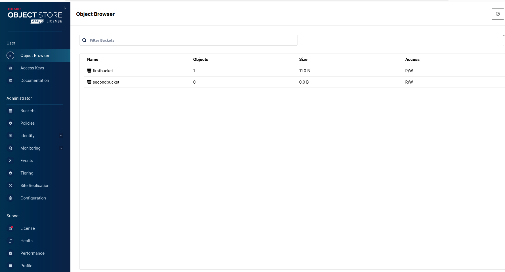
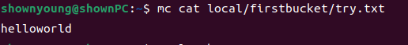
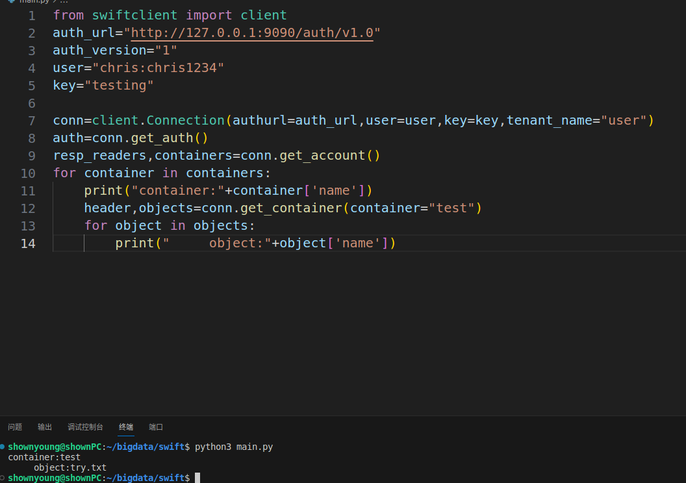

# Lab 1 搭建对象存储

# 实验环境
Linux平台\
Ubuntu 22.04.3 LTS

# 实验记录

## 实验1-1：服务端搭建
首先尝试使用最简单的Minio服务端，下载好之后尝试运行
\
服务端网页界面

## 实验1-2：客户端搭建
同样先尝试使用最简单的Minio客户端，下载好之后，为自己的服务器相关配置起别名为local\
随后尝试列出自己服务器端的所有文件\
\
尝试输出自己服务器端文件的内容\
\
可见客户端也搭建成功
## 实验1-3：服务端升级
尝试在docker容器中使用Swift来作为服务端\
首先在linux中下载docker，其次从镜像网站获取运行简易swift的对接命令，从而获得只有一个副本和设备的fnndsc/docker-swift-onlyone镜像\
之后在终端中运行一系列命令，创建容器来运行该应用，将容器端口设置为9090\
下载swiftclient包，尝试使用swift命令来进行获取授权
获取成功，可见Swift服务器端搭建成功

## 实验1-4：客户端升级
通过python语言和swift官方的python库，从而将终端运行改为API编程\
预先设定好地址、用户名和密码，使用swiftclient库中的Connection类进行初始化，在获取验证后尝试获取服务端中的容器与容器中对应的对象\
\
可见获取成功，使用API编程的Swift客户端搭建成功

# 实验小结
在本次实验中，首先尝试了使用minio的服务端与客户端，对对象存储的部署与操作有了初始的认识，随后尝试对其进行升级；在swift服务端的部署中了解了容器的简单用法并能成功使用容器运行一些应用；在客户端的开发中了解了swift相关API的使用并能进行简单基本的操作。