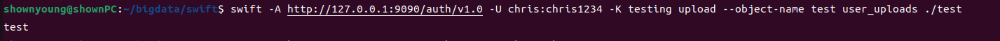
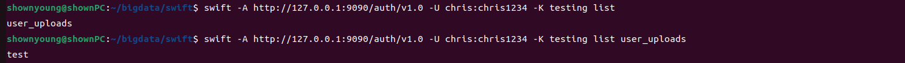
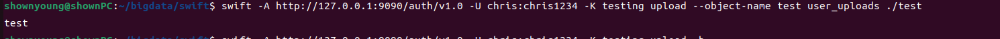
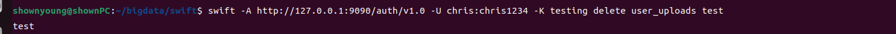
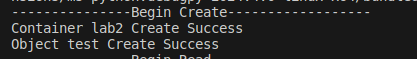
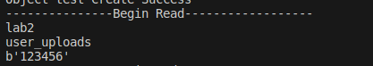
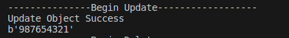
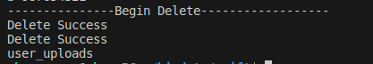

# Lab 2 实践基本功能

# 实验环境 
Linux平台\
Ubuntu 22.04.3 LTS\
服务器：基于docker的Swift\
客户端：基于swiftclient的pythonAPI编程

# 实验记录

## 实验2-1：典型客户端实现CRUD基本操作
* Create操作\
向user_uploads容器中上传test文件

* Read操作\
读取所有容器及user_uploads容器中文件

* Update操作\
修改test文件后重新上传

* Delete操作
删除user_uploads容器中的文件并重新读取

## 实验2-2：API编程实现CRUD基本操作
* Create操作\
首先检测是创建容器还是创建对象文件，然后分别调用对应的函数进行创建，这里创建lab2容器并在其中创建test文件

* Read操作\
读取所有容器并读取lab2容器内文件内容

* Update操作\
修改test文件内容进行更新\

* Delete操作
删除test文件后删除lab2容器，随后重新读取\

# 实验小结
在本实验中使用典型客户端和api编程两种方法实现了CRUD这4种访问持久化存储的基本操作，对服务器和客户端的操作更加熟悉了