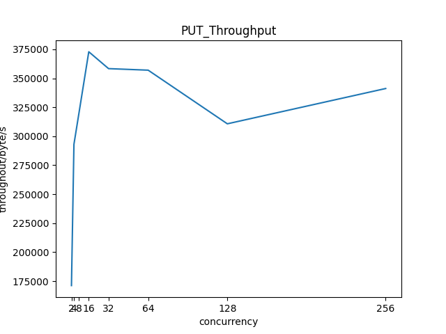
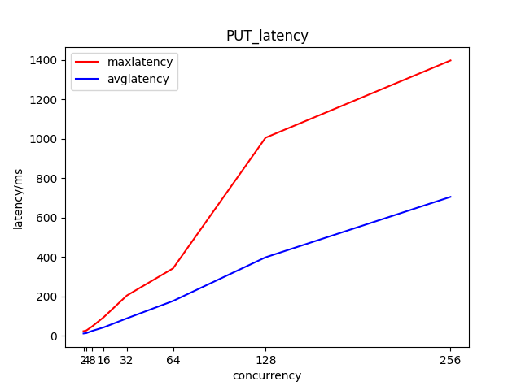
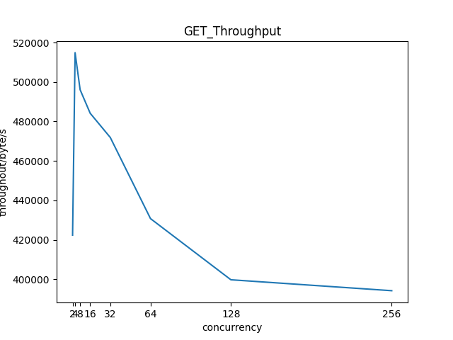
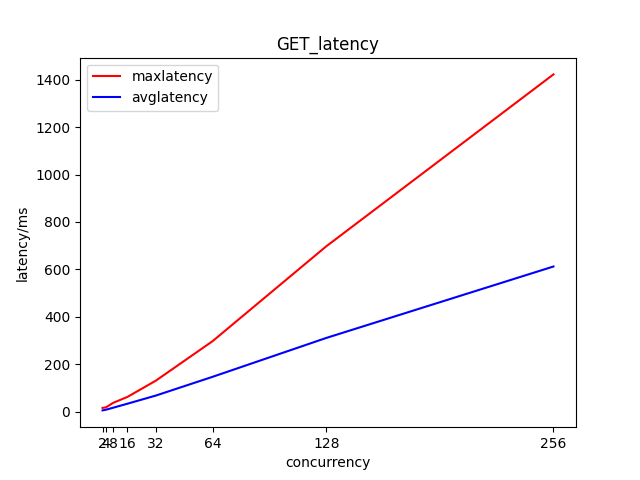

# Lab 3 观测分析性能

# 实验环境
Linux平台\
Ubuntu 22.04.3 LTS\
服务器：基于docker的Swift\
客户端：基于swiftclient的pythonAPI编程

# 实验记录

## 实验3-1：输出并分析性能
在互联网上找到了支持对swift进行测试的swift-bench包，稍加修改后使其能够将数据输出到文件中。首先在文件大小为100,文件个数为100,并发数为10的情况下进行测试，结果文件为[GETS数据](./assets/data/GETS_100_10_100.csv) [PUTS数据](./assets/data/PUTS_100_10_100.csv) ,其中前面的数据格式为操作ID，开始时间，结束时间，延时，时间数据一律以ms为单位。最后一行为吞吐率，以byte/s为单位。
## 实验3-2：请求并发数如何影响性能
在保持文件大小为1000，对象数为2000不变的情况下，对并发数取2^1-2^8，进行测试并输出测试文件\
然后对测试数据进行统计，对每次测试，取其吞吐率进行作图。对每次测试的延迟，分别取其最大延迟和平均延迟进行比较以期全面分析。\

观察数据图得到如下结论：
* 无论对读操作还是写操作，随着并发数增加，延迟都会逐渐上升，大概i成线性水平。
* 对读操作而言，随并发数增加，吞吐量会首先快速上升再迅速下降，下降速度是逐渐减缓的。
* 对写操作而言，随并发数增加，吞吐量会首先快速上升再逐渐下降
* 对于本次测试而言，将并发数定在16左右是较为合适的，这样能保证读写的吞吐率都相对较高且延迟不高。

## 实验3-3：如何保障服务质量
通过查询网上资料并与本次实验结论相结合得到如下措施：
* 流量控制：通过使用适合的流量控制机制，如限流、排队等，通过控制并发请求的数量以避免系统超载，从而保障服务质量。
* 资源管理：合理配置系统资源，增加服务器容量或优化算法等，通过提高系统的处理能力和性能来应对高并发请求。
* 负载均衡：在一定范围内增加服务器数量，使用负载均衡器将请求分发到不同的服务器上来分散高并发带来的压力，从而提高系统的稳定性
* 监控和调优：实时监控系统性能指标如延迟、吞吐率、错误率等，及时发现和解决性能瓶颈和故障，保障服务质量。

# 实验小结
在本次实验中，我使用swift-bench对构建的服务器进行了性能测试，并研究了请求并发数对性能的影响。最后，在上述实验结果的基础上并查阅了相关资料，对实际使用中如何保障服务质量进行了研究。