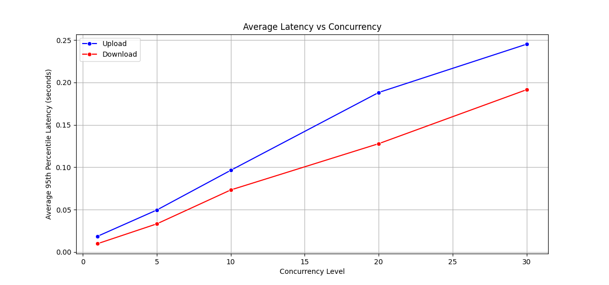

# 实验名称 探究对象大小和并发数对尾延迟的影响

# 实验环境

```
Virtual Machine: VMware Workstation 17
OS: Ubuntu22.04
CPU: Ryzen R7 5800H
RAM: 8G
Server: Swift、minio
Client: Swift-client、s3bench
```

# 实验记录

## 使用s3bench对minio服务器进行测试

脚本见/asset/s3bench.sh

由于swift服务器天然不兼容s3接口，因此下面使用swift-client对swift服务器进行测试

## 实验3-1: 探究对象大小对尾延迟的影响


观察到各个并发度下，随着对象大小的增大，尾延迟也随之增大。

## 实验3-2: 探究并发度对尾延迟的影响



观察到，在上传和下载时，随着并发度的增大，尾延迟也随之增大

# 实验小结

在此次实验中了解到了对象大小和并发度对对象存储系统尾延迟的影响。学会了测量对象存储系统的尾延迟。