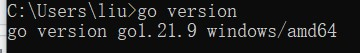

# 观测分析性能

# 实验环境

## 处理器

Intel(R) Core(TM) i5-8250U CPU @ 1.60GHz   1.80 GHz

## 版本

Windows 10 家庭版

# 实验记录

下载go环境



下载S3bench `go install github.com/igneous-systems/s3bench@latest`

通过运行注释掉删除桶代码行的Lab2python程序来创建测试桶

再使用命令删除桶`s3bench -accessKey=test:tester -accessSecret=testing -bucket=testbucket -endpoint=http://localhost:12345 -numClients=2 -numSamples=10 -objectNamePrefix=loadgen -objectSize=1024 -region=us-east-1`

得到以下输出
```
bucket:           new-bucket
objectNamePrefix: loadgen
objectSize:       0.0010 MB
numClients:       2
numSamples:       10
verbose:       %!d(bool=false)


Generating in-memory sample data... Done (0s)

Running Write test...

Running Read test...

Test parameters
endpoint(s):      [http://localhost:12345]
bucket:           new-bucket
objectNamePrefix: loadgen
objectSize:       0.0010 MB
numClients:       2
numSamples:       10
verbose:       %!d(bool=false)


Results Summary for Write Operation(s)
Total Transferred: 0.010 MB
Total Throughput:  0.02 MB/s
Total Duration:    0.420 s
Number of Errors:  0
------------------------------------
Write times Max:       0.197 s
Write times 99th %ile: 0.197 s
Write times 90th %ile: 0.197 s
Write times 75th %ile: 0.070 s
Write times 50th %ile: 0.063 s
Write times 25th %ile: 0.049 s
Write times Min:       0.034 s


Results Summary for Read Operation(s)
Total Transferred: 0.010 MB
Total Throughput:  0.10 MB/s
Total Duration:    0.097 s
Number of Errors:  0
------------------------------------
Read times Max:       0.037 s
Read times 99th %ile: 0.037 s
Read times 90th %ile: 0.037 s
Read times 75th %ile: 0.022 s
Read times 50th %ile: 0.014 s
Read times 25th %ile: 0.010 s
Read times Min:       0.007 s


Cleaning up 10 objects...
Deleting a batch of 10 objects in range {0, 9}... Succeeded
Successfully deleted 10/10 objects in 267.2244ms
```

修改参数设置不同客户机数量形成对照实验
```
D:\Download\go1.21.9.windows-amd64\GO项目\lib\bin> s3bench -accessKey=test:tester -accessSecret=testing -bucket=test-bucket -endpoint=http://localhost:12345 -numClients=2 -numSamples=10 -objectNamePrefix=loadgen -objectSize=1024 -region=us-east-1 >Clients2.txt

D:\Download\go1.21.9.windows-amd64\GO项目\lib\bin> s3bench -accessKey=test:tester -accessSecret=testing -bucket=test-bucket -endpoint=http://localhost:12345 -numClients=4 -numSamples=10 -objectNamePrefix=loadgen -objectSize=1024 -region=us-east-1 >Clients4.txt

D:\Download\go1.21.9.windows-amd64\GO项目\lib\bin> s3bench -accessKey=test:tester -accessSecret=testing -bucket=test-bucket -endpoint=http://localhost:12345 -numClients=8 -numSamples=10 -objectNamePrefix=loadgen -objectSize=1024 -region=us-east-1 >Clients8.txt

```

测试结果
[Clients2.txt](Clients2.txt)
[Clients4.txt](Clients4.txt)
[Clients8.txt](Clients8.txt)

根据数据，我们可以分析在不同用户机数量2, 4, 8下的性能表现。我们将关注于写入（Write）和读取（Read）操作的总吞吐量、总持续时间、以及操作时间的分布。
写入操作分析

### 总吞吐量和总持续时间：
当用户机数量为2时，总吞吐量为0.02 MB/s，总持续时间为0.420秒。  
当用户机数量增加到4时，总吞吐量提升到0.03 MB/s，总持续时间减少到0.328秒。  
当用户机数量为8时，总吞吐量进一步提升到0.04 MB/s，总持续时间减少到0.256秒。  
随着用户机数量的增加，写入操作的总吞吐量提升，总持续时间减少，表明系统能够更有效地处理并发写入请求。

### 操作时间分布：
随着用户机数量的增加，写入操作的最大时间（Max）、99th百分位时间、90th百分位时间均有所增加，但中位数（50th百分位）和最小时间（Min）有所减少。这表明虽然大部分写入操作能够更快完成，但在高并发下，某些写入请求的处理时间会增加。

## 读取操作分析
### 总吞吐量和总持续时间：
当用户机数量为2时，总吞吐量为0.10 MB/s，总持续时间为0.097秒。  
当用户机数量为4时，总吞吐量提升到0.14 MB/s，总持续时间减少到0.069秒。  
当用户机数量为8时，总吞吐量减少到0.08 MB/s，总持续时间增加到0.117秒。  
在用户机数量增加到4时，读取操作的效率最高，但当用户机数量增加到8时，吞吐量有所下降，持续时间有所增加，可能是因为并发读取请求增多导致的资源竞争。

### 操作时间分布：
与写入操作相似，读取操作的最大时间（Max）、99th百分位时间、90th百分位时间随用户机数量的增加有所变化。特别是当用户机数量为8时，读取操作的最大时间显著增加，这可能是因为并发度增加导致的系统负载增大。

## 总结
写入操作随着用户机数量的增加表现出更高的吞吐量和更短的总持续时间，但高并发情况下某些请求的处理时间会增加。  
读取操作在用户机数量为4时表现最佳，但当用户机数量增加到8时，性能有所下降，表明可能存在并发处理的瓶颈。  
在进行类似的负载测试时，需要平衡并发用户数量和系统资源，以达到最佳的性能表现。

# 实验小结

在本次实验中使用了S3bench进行了服务器性能的测试，然后整理数据进行分析。